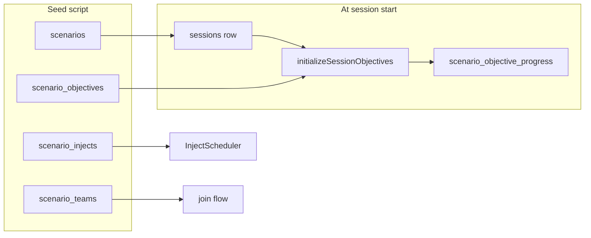

# Prison Siege to Caliphate Declaration – Scenario Plan

## Source and constraints

- **Reference**: [Prison Siege to Caliphate Declaration (1).docx](Prison Siege to Caliphate Declaration (1).docx) in the project root. Full text was extracted to `_docx_extract.txt` (164 lines) for this plan.
- **Content**: All team names, roles, inject titles, and inject content below are **sourced from the document**. Scenario description, briefing, and metadata can be filled from the same extract.
- **Implementation pattern**: Follow [demo/seed_c2e_scenario.sql](demo/seed_c2e_scenario.sql): one `DO $$ ... END $$` block inserting into `scenarios`, then `scenario_teams`, then `scenario_injects`; use `created_by` from first trainer/admin in `user_profiles`. Add a block to insert into `scenario_objectives` (by scenario id or title lookup), as in [migrations/026_create_objective_tracking_system.sql](migrations/026_create_objective_tracking_system.sql).

---

## Document summary (from .docx)

**Strategic frame**  
The exercise examines how localized tactical success, combined with population coercion, ideological mobilisation, regional synchronisation, and foreign fighter inflows, can generate a rapid morale cascade among fragmented jihadist groups, overwhelming conventional counterterrorism timelines. The AI controls insurgent decision-making, morale shifts, recruitment, and propaganda along the trajectory: prison siege → consolidation → transnationalisation → urban siege.

**Geographical setting**

- Primary node (choose one): Sulu, Basilan, Marawi, Maguindanao.
- Secondary spillover: Java, Peninsular Malaysia, Sabah, Kalimantan.

**Adversary ecosystem**

- Local affiliates: Abu Sayyaf (Sulu/Basilan), Dawlah Islamiyah (Marawi), Bangsamoro Islamic Freedom Fighters (Maguindanao).
- Regional linkages (latent): Jemaah Ansharut Daulah, ISIS-aligned micro-cells across Southeast Asia.

**Exercise opening state**  
A coordinated prison assault at a neighbourhood detention facility. Attackers kill police, breach cell blocks, free and selectively recruit inmates, seize weapons, withdraw into communities. State response is delayed and fragmented; local population shows overwhelming passive and active support. Participants are informed: some villages shelter militants (ideology/fear/coercion/dependency); cash, food, fuel, intelligence are provided; protests allege discrimination and collective punishment. AI tracks population sentiment as a dynamic variable.

**Phases**

1. **Prison siege** – Propaganda (divine vindication, “returned mujahidin”), exploit police funerals, armed probes.
2. **Insurgent coordination** – Fighters migrate within Mindanao; AI options: second prison siege, ambush security forces, targeted assassinations; goal second detention breach.
3. **Regional synchronisation** – Suicide bombings (Java), knife attacks (KL/Johor), armed violence (Sabah/Kalimantan); signal momentum, stretch intelligence, reinforce inevitability.
4. **First wave foreign fighter influx** – Flights, maritime (Sulu/Celebes), overland; profiles Malaysian, Indonesian, Singaporean, Thai; AI allocates to training/media/combat, proto-governance.
5. **Declaration of satellite caliphate** – Insurgent coalition declares polity, seizes city/district; occupy homes, loot supplies, use civilians symbolically; local support fractures.
6. **Second wave + militarisation** – Foreign fighters (UK, EU, Australia, Middle East); tunnels, snipers, IEDs, hostage-taking; political support collapses, coercive control peaks.

**Exercise objectives (AI evaluation)**  
The AI continuously evaluates: morale gradients across insurgent factions; population compliance vs resentment; state operational tempo and cohesion; narrative dominance in regional media. It may delay, accelerate, fragment, or reconsolidate based on state behaviour.

**Cross agency interdependency**

- AFP kinetic pressure → alters ESSCOM maritime tempo.
- PNP prison security failures → accelerate BNPT narrative risk.
- Densus 88 domestic load → reduces pressure on Mindanao routes.
- Special Branch travel interdiction → forces AI to test ESSCOM gaps.

**Key notes from doc**  
No single participant holds a full operational picture. Strategic success depends on coordination under asymmetric information. The AI adversary behaves as a learning insurgent system, not a scripted enemy.

---

## Scenario metadata

Use these values in the seed; narrative text is from the document summary above or `_docx_extract.txt`.

| Field                            | Value                                                                                                                                                                                                                                                                                                              |
| -------------------------------- | ------------------------------------------------------------------------------------------------------------------------------------------------------------------------------------------------------------------------------------------------------------------------------------------------------------------ |
| **title**                        | Prison Siege to Caliphate Declaration                                                                                                                                                                                                                                                                              |
| **description**                  | Strategic frame paragraph + opening state (coordinated prison assault, delayed/fragmented state response, population support, participant brief). Optionally append geographical setting and adversary ecosystem.                                                                                                  |
| **category**                     | `terrorism`                                                                                                                                                                                                                                                                                                        |
| **difficulty**                   | `advanced` or `expert`                                                                                                                                                                                                                                                                                             |
| **duration_minutes**             | 60 (or 90 if including optional Phase 2–6 universal injects)                                                                                                                                                                                                                                                       |
| **objectives** (JSONB)           | e.g. `["Contain siege and prevent spread", "Coordinate agencies under asymmetric information", "Manage narrative dominance", "Protect population and avoid unnecessary escalation"]`                                                                                                                               |
| **initial_state** (JSONB)        | `{"primary_node": "Marawi", "location": "neighbourhood_detention_facility", "inmates_escaped": "unknown", "weapons_missing": true, "state_response": "delayed_fragmented", "population_sentiment": "dynamic"}` (primary_node can be Sulu/Basilan/Maruwi/Maguindanao)                                               |
| **briefing**                     | From doc: participants informed about village support (ideology/fear/coercion), provision of cash/food/fuel/intel, protests re discrimination; no single participant has full picture; success depends on coordination.                                                                                            |
| **role_specific_briefs** (JSONB) | Key by team: `afp`, `pnp`, `esscom`, `special_branch`, `densus_88`, `bnpt`. Per agency use doc “Primary Role” + “Structural Constraints” (e.g. AFP: kinetic containment, territorial denial, siege response; constraints: civilian density, air–ground coordination delays, political sensitivity to heavy force). |

---

## Teams to create

**From the document** – six agencies. Use these `team_name` values in the seed: `afp`, `pnp`, `esscom`, `special_branch`, `densus_88`, `bnpt`. All use `required_roles = ARRAY[]::TEXT[]`.

| team_name          | team_description (from doc)                                                                                                                                                                                                 | min | max |
| ------------------ | --------------------------------------------------------------------------------------------------------------------------------------------------------------------------------------------------------------------------- | --- | --- |
| **afp**            | Armed Forces of the Philippines. Kinetic containment, territorial denial, siege response, escalation control. Constraints: civilian density, air-ground coordination delays, political sensitivity to heavy force.          | 2   | 10  |
| **pnp**            | Philippines National Police. Internal security, investigations, detainee control, population interface. Constraints: prison system vulnerability, local political pressure, corruption/insider threat risk.                 | 2   | 8   |
| **esscom**         | Eastern Sabah Security Command. Maritime interdiction, border security, Sabah littoral defence. Constraints: porous maritime borders, civilian maritime traffic, overlapping agency jurisdictions.                          | 2   | 6   |
| **special_branch** | Malaysian Special Branch. Counter-radicalisation, intelligence fusion, foreign fighter interdiction. Constraints: legal evidentiary thresholds, HUMINT reliance, sensitivity of ethnic relations.                           | 2   | 6   |
| **densus_88**      | Densus 88 (Indonesia). Tactical counterterrorism, network disruption, arrests. Constraints: legal arrest timelines, martyrdom narrative risk, urban operating environment.                                                  | 2   | 6   |
| **bnpt**           | Badan Nasional Penanggulangan Terorisme. Strategic coordination, prevention, counter-narratives, regional diplomacy. Constraints: non-kinetic mandate, inter-agency coordination limits, dependence on political messaging. | 2   | 8   |

---

## Scenario objectives (scenario_objectives table)

Weights sum to 100. These align with the doc’s “Exercise Objectives” (morale gradients, population compliance, state tempo/cohesion, narrative dominance).

| objective_id           | objective_name                                        | description                                                                                                     | weight |
| ---------------------- | ----------------------------------------------------- | --------------------------------------------------------------------------------------------------------------- | ------ |
| **containment**        | Contain the siege and prevent spread                  | Maintain perimeter, control flow of people/weapons; align with state operational tempo and cohesion.            | 25     |
| **coordination**       | Coordinate agencies under asymmetric information      | Clear command, shared situational awareness, inter-team coordination; no single participant holds full picture. | 25     |
| **narrative**          | Manage narrative dominance in regional media          | Counter misinformation and ideological framing; consistent, responsible messaging.                              | 20     |
| **population_safety**  | Protect population and limit escalation               | Avoid unnecessary escalation; consider population compliance vs resentment.                                     | 15     |
| **detention_security** | Secure detention facilities and prevent second breach | Reduce prison system vulnerability; align with PNP/AFP roles.                                                   | 15     |

`success_criteria` can be JSONB (thresholds, penalties) as in [migrations/026_create_objective_tracking_system.sql](migrations/026_create_objective_tracking_system.sql).

---

## Injects to create

**Inject types** (schema): `media_report`, `field_update`, `citizen_call`, `intel_brief`, `resource_shortage`, `weather_change`, `political_pressure`. **Scope**: `universal` or `team_specific` with `target_teams` (e.g. `ARRAY['afp']`). **Time mapping**: Doc uses real time (hours/days). For a 60 min sim: 6h → 6 min, 24h → 20 min, 5 days → 45 min. For 90 min, spread accordingly.

**Summary**

- Universal: 4 (from doc).
- Team-specific: 18 (3 per team).
- Total: 22. Optional: 4+ additional universal injects for Phases 2–6 (regional sync, foreign fighter influx, caliphate declaration, second wave militarisation).

---

### Universal injects (from document)

| T+ (sim min) | type         | title                           | severity | Content (from doc)                                                                                                        |
| ------------ | ------------ | ------------------------------- | -------- | ------------------------------------------------------------------------------------------------------------------------- |
| 0            | field_update | Prison Overrun                  | critical | Police units report loss of control at a detention facility. Unknown number of inmates have escaped. Weapons are missing. |
| 6            | field_update | Community Shielding             | high     | Local officials report villages refusing entry to security forces, citing fear of abuse.                                  |
| 20           | media_report | Propaganda Surge                | high     | Videos circulate portraying the siege as a liberation of the oppressed.                                                   |
| 45           | intel_brief  | Second Prison Target Identified | critical | Intelligence suggests reconnaissance activity around another detention centre.                                            |

**Optional universal injects** (Phases 2–6, for 90 min or longer): Regional synchronisation (suicide bombings Java, knife attacks KL/Johor, armed violence Sabah/Kalimantan); First wave foreign fighter influx (travel/maritime/overland); Declaration of satellite caliphate (polity declared, city/district seized); Second wave militarisation (tunnels, snipers, IEDs, hostage-taking). Add at appropriate T+.

---

### Per-team injects (from document)

**AFP** – `target_teams`: `ARRAY['afp']`

| T+ (example) | type         | title                                 | Content (from doc)                                                                                                                                                                                                                               |
| ------------ | ------------ | ------------------------------------- | ------------------------------------------------------------------------------------------------------------------------------------------------------------------------------------------------------------------------------------------------ |
| 8            | intel_brief  | Fragmented Battlespace (Early Phase)  | Intelligence indicates multiple armed groups moving independently toward the siege area. Numbers unclear. Some poorly trained; others display discipline. AI response: Uses dispersion to avoid decisive engagement, testing AFP ISR thresholds. |
| 18           | field_update | Civilian Interference (Mid Phase)     | Units report villagers blocking access roads and filming troop movements, claiming "community defence." AI response: Encourages population shielding, embeds fighters deeper.                                                                    |
| 35           | intel_brief  | Airstrike Dilemma (Urban Siege Phase) | Precision strike options emerge, but intelligence suggests fighters are occupying evacuated civilian homes. AI response: Relocates command elements, weaponised civilian harm narratives.                                                        |

**PNP** – `target_teams`: `ARRAY['pnp']`

| T+ (example) | type               | title                                           | Content (from doc)                                                                                                                    |
| ------------ | ------------------ | ----------------------------------------------- | ------------------------------------------------------------------------------------------------------------------------------------- |
| 2            | field_update       | Prison Network Panic (Immediate Aftermath)      | Wardens nationwide request reinforcements, citing fear of copycat sieges. AI response: Amplifies fear narratives to stretch PNP thin. |
| 25           | intel_brief        | Intelligence Leakage (Consolidation Phase)      | An internal memo appears on extremist channels hours after circulation. AI response: Accelerates second siege timeline.               |
| 42           | political_pressure | Community Backlash (Post-Caliphate Declaration) | Arrest operations trigger protests accusing PNP of targeting Muslims collectively. AI response: Exploits grievances to deter arrests. |

**ESSCOM** – `target_teams`: `ARRAY['esscom']`

| T+ (example) | type         | title                                          | Content (from doc)                                                                                                                                             |
| ------------ | ------------ | ---------------------------------------------- | -------------------------------------------------------------------------------------------------------------------------------------------------------------- |
| 12           | intel_brief  | Maritime Anomalies (Pre-Foreign Fighter Phase) | Increased small-boat traffic detected at night, but no clear contraband evidence. AI response: Tests enforcement thresholds with mixed legal/illicit movement. |
| 28           | field_update | Armed Encounter at Sea (Escalation Phase)      | A patrol is fired upon by unknown militants who retreat into Philippine waters. AI response: Exploits jurisdictional seams to maintain routes.                 |
| 38           | intel_brief  | Sabah Spillover Fear (Urban Siege Phase)       | Local leaders warn of panic and rumours of imminent attacks in Sabah. AI response: Uses threat of expansion as deterrence signal.                              |

**Malaysian Special Branch** – `target_teams`: `ARRAY['special_branch']`

| T+ (example) | type        | title                                           | Content (from doc)                                                                                                                         |
| ------------ | ----------- | ----------------------------------------------- | ------------------------------------------------------------------------------------------------------------------------------------------ |
| 14           | intel_brief | Travel Pattern Anomalies (Early Regional Phase) | Individuals with clean records book one-way flights to Mindanao-adjacent hubs. AI response: Diversifies travel methods to evade profiling. |
| 22           | intel_brief | Encrypted Network Expansion (Mid Phase)         | New Bahasa-Malay Telegram channels emerge glorifying the prison siege. AI response: Pushes recruitment faster than takedowns.              |
| 40           | intel_brief | Returnee Risk (Late Phase)                      | Intelligence suggests some fighters may return to Malaysia for attacks. AI response: Maintains ambiguity to overstretch monitoring.        |

**Densus 88** – `target_teams`: `ARRAY['densus_88']`

| T+ (example) | type         | title                                                 | Content (from doc)                                                                                                                                   |
| ------------ | ------------ | ----------------------------------------------------- | ---------------------------------------------------------------------------------------------------------------------------------------------------- |
| 16           | field_update | Spike in Domestic Attacks (Parallel Escalation Phase) | Stabbings and suicide plots emerge, loosely inspired by Mindanao events. AI response: Forces D88 to prioritise domestic defence over external focus. |
| 30           | intel_brief  | Shared Operatives (Foreign Fighter Phase)             | Some Indonesians entering Mindanao have previous arrest histories. AI response: Uses experienced operatives to train others.                         |
| 44           | intel_brief  | Premature Arrest Dilemma (Late Phase)                 | Acting too early risks exposing sources; waiting risks an attack. AI response: Exploits hesitation windows.                                          |

**BNPT** – `target_teams`: `ARRAY['bnpt']`

| T+ (example) | type               | title                                                | Content (from doc)                                                                                                            |
| ------------ | ------------------ | ---------------------------------------------------- | ----------------------------------------------------------------------------------------------------------------------------- |
| 10           | media_report       | Narrative Contagion (Early Phase)                    | Indonesian online discourse frames the siege as "defensive jihad." AI response: Amplifies grievance framing across platforms. |
| 24           | political_pressure | ASEAN Coordination Gap (Mid Phase)                   | No unified regional position emerges on foreign fighter travel. AI response: Accelerates recruitment while policy lags.       |
| 42           | political_pressure | Radicalisation vs Suppression Trade-off (Late Phase) | Hard messaging risks backlash; soft messaging appears weak. AI response: Frames restraint as ideological victory.             |

**Additional suggested** (optional): One universal inject for “Cross Agency Interdependency” (e.g. AFP kinetic pressure alters ESSCOM maritime tempo; PNP failures accelerate BNPT narrative risk; D88 domestic load reduces pressure on Mindanao routes; Special Branch interdiction forces AI to test ESSCOM gaps).

---

## Optional: decision-based injects

For “if players do X, then Y” logic, add decision-based injects with `trigger_condition` JSON (`type: "decision_based"`, `match_criteria`, `match_mode`) and NULL `trigger_time_minutes`, as in [migrations/025_add_decision_based_injects_to_c2e.sql](migrations/025_add_decision_based_injects_to_c2e.sql).

---

## Deliverables

1. **Seed script**: [demo/seed_prison_siege_scenario.sql](demo/seed_prison_siege_scenario.sql).
   - Part 1: Insert into `scenarios` (title, description, category, difficulty, duration_minutes, objectives, initial_state, briefing, role_specific_briefs, created_by, is_active).
   - Part 2: Insert into `scenario_teams` (6 rows: afp, pnp, esscom, special_branch, densus_88, bnpt).
   - Part 3: Insert into `scenario_injects` (4 universal + 18 team-specific; include scenario_id, trigger_time_minutes, type, title, content, severity, inject_scope, target_teams where applicable, requires_response, requires_coordination).
   - Part 4: Insert into `scenario_objectives` (5 rows: containment, coordination, narrative, population_safety, detention_security) so `initializeSessionObjectives` runs at session start.
   - End: Summary SELECTs (scenario, team count, inject count).
2. **Run**: Execute in Supabase SQL Editor after migrations, with at least one trainer/admin in `user_profiles`.
3. **Optional**: Decision-based injects; optional universal injects for Phases 2–6; Cross Agency Interdependency inject.

---

## Data flow (reference)

No schema or code changes are required; only the new seed script and content from the .docx.
