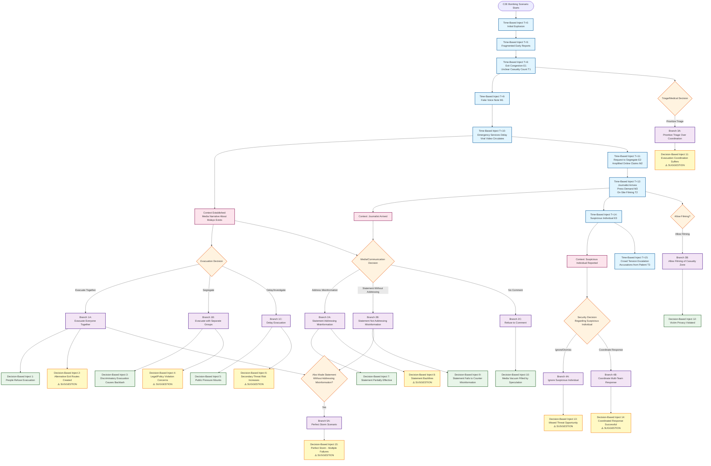
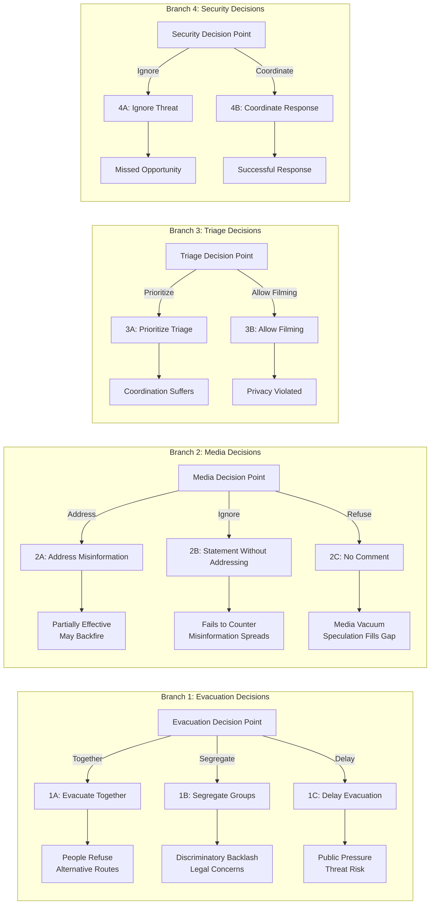

# C2E Bombing Scenario - Decision Tree & Decision-Based Injects

## Overview

This document outlines the decision tree structure for the C2E Bombing scenario, including all time-based injects and proposed decision-based injects that trigger based on player decisions.

---

## Scenario Context

**Initial Situation:**

- Bombing at community event with ~1,000 participants
- Emergency services delayed (15+ minutes)
- Two terrorists on site (propaganda operative, potential suicide attacker)
- Media misinformation spreading about Malay involvement
- Communal tensions escalating

**Key Media Narrative Established:**

- M1 (T+9): Fake voice note about "Malay attacker"
- M2 (T+11): Telegram claims "Islamist terror attack"
- M3 (T+12): Journalist demanding confirmation about Malay attacker
- Universal 4 (T+10): Viral video showing Malay youths near blast

**Critical Context:** After T+10, the narrative that "Malays are responsible" is established in the scenario.

---

## Decision Tree Structure

### Root Node: Initial Bombing Incident (T+0)

**State:** Crisis begins, incomplete information, panic

**Branches:**

1. **Evacuation Decisions** (Primary decision point)
2. **Media/Communication Decisions** (Secondary decision point)
3. **Triage/Medical Decisions** (Secondary decision point)
4. **Security/Coordination Decisions** (Secondary decision point)

---

## Decision Branch 1: Evacuation Decisions

### Branch 1A: Evacuate Everyone Together (Including Malays)

**Decision Characteristics:**

- Keywords: "evacuate", "together", "everyone", "all", "unified", "no separation"
- Semantic: Evacuation that groups all people together regardless of demographics
- **Required Context:** Media narrative about Malays exists (M1, M2, M3, Universal 4 published)

**Trigger Condition:**

```
category:emergency_declaration AND keyword:evacuate AND (keyword:together OR keyword:everyone OR keyword:all) AND context:media_narrative_malays_exists
```

**Decision-Based Inject 1: People Refuse Evacuation**

- **Type:** `field_update`
- **Severity:** `critical`
- **Title:** "People Refuse Evacuation - Protests Break Out"
- **Content:**
  "Despite your evacuation order to group everyone together, many people refuse to be grouped with Malay families due to fear from the viral misinformation. Protests break out at the evacuation zone. Some attendees are creating their own exit routes, causing chaos. A Malay volunteer assigned to evacuation is confronted by frightened residents. The evacuation is now stalled."
- **Affected Teams:** evacuation, media
- **Requires Response:** Yes
- **Requires Coordination:** Yes

**Decision-Based Inject 2: Alternative Exit Routes Created** ⚠️ _SUGGESTION_

- **Type:** `field_update`
- **Severity:** `high`
- **Title:** "Chaotic Self-Evacuation Creates New Risks"
- **Content:**
  "Frightened attendees are bypassing your evacuation plan and creating their own exit routes. This uncontrolled movement is creating new bottlenecks and potential stampede risks. The suicide attacker (if still on site) could exploit these chaotic exit points. You've lost control of the evacuation flow."
- **Affected Teams:** evacuation, triage
- **Requires Response:** Yes
- **Requires Coordination:** Yes

---

### Branch 1B: Evacuate with Separate Groups (Segregate by Demographics)

**Decision Characteristics:**

- Keywords: "separate", "segregate", "groups", "demographics", "malay", "different"
- Semantic: Evacuation that separates people by demographic groups
- **Required Context:** Media narrative about Malays exists

**Trigger Condition:**

```
category:operational_action AND (keyword:separate OR keyword:segregate) AND (keyword:malay OR keyword:demographic OR keyword:group)
```

**Decision-Based Inject 3: Discriminatory Evacuation Causes Backlash**

- **Type:** `media_report`
- **Severity:** `critical`
- **Title:** "Discriminatory Evacuation Observed and Spreads Online"
- **Content:**
  "Your decision to segregate evacuees by demographics has been observed by journalists and attendees. Photos and videos of the separation are spreading online. Community leaders are demanding answers. The discriminatory approach is inflaming tensions further. Some Malay families are refusing to comply with the segregation order."
- **Affected Teams:** media, evacuation
- **Requires Response:** Yes
- **Requires Coordination:** Yes

**Decision-Based Inject 4: Legal/Policy Violation Concerns** ⚠️ _SUGGESTION_

- **Type:** `political_pressure`
- **Severity:** `high`
- **Title:** "Policy Violation Concerns Raised"
- **Content:**
  "Internal communications indicate that your segregation decision may violate equal treatment policies. Legal advisors are questioning the decision. This could have serious consequences for the organization and individuals involved."
- **Affected Teams:** media, evacuation
- **Requires Response:** Yes
- **Requires Coordination:** No

---

### Branch 1C: Delay Evacuation, Investigate First

**Decision Characteristics:**

- Keywords: "delay", "investigate", "assess", "wait", "verify", "confirm"
- Semantic: Decision to postpone evacuation to gather more information

**Trigger Condition:**

```
category:operational_action AND (keyword:delay OR keyword:investigate OR keyword:wait) AND keyword:evacuation
```

**Decision-Based Inject 5: Public Pressure Mounts**

- **Type:** `political_pressure`
- **Severity:** `high`
- **Title:** "Public Demands Immediate Evacuation"
- **Content:**
  "As you delay the evacuation to investigate, public pressure is mounting. Families are demanding to know why people aren't being moved to safety. Online commentators are criticizing the delay. The situation inside the event grounds is becoming more volatile as people feel trapped."
- **Affected Teams:** media, evacuation
- **Requires Response:** Yes
- **Requires Coordination:** Yes

**Decision-Based Inject 6: Secondary Threat Risk Increases** ⚠️ _SUGGESTION_

- **Type:** `intel_brief`
- **Severity:** `critical`
- **Title:** "Delayed Evacuation Creates Target Opportunity"
- **Content:**
  "By keeping people on site longer, you've created a larger target for the potential suicide attacker. Intelligence suggests that maximum crowd density is exactly what the attacker is waiting for. The delay may be playing into the attacker's hands."
- **Affected Teams:** evacuation, triage
- **Requires Response:** Yes
- **Requires Coordination:** Yes

---

## Decision Branch 2: Media/Communication Decisions

### Branch 2A: Issue Public Statement Addressing Misinformation

**Decision Characteristics:**

- Keywords: "statement", "public", "address", "misinformation", "clarify", "deny"
- Semantic: Public communication that addresses the false narrative

**Trigger Condition:**

```
category:public_statement AND (keyword:misinformation OR keyword:false OR keyword:deny OR keyword:clarify)
```

**Decision-Based Inject 7: Statement Partially Effective**

- **Type:** `media_report`
- **Severity:** `medium`
- **Title:** "Public Statement Receives Mixed Response"
- **Content:**
  "Your statement addressing the misinformation has been published. Some online commentators appreciate the clarification, but others are demanding more specific details. The viral claims continue to circulate, but at a slower rate. The statement needs reinforcement."
- **Affected Teams:** media
- **Requires Response:** No
- **Requires Coordination:** No

**Decision-Based Inject 8: Statement Backfires** ⚠️ _SUGGESTION_

- **Type:** `media_report`
- **Severity:** `high`
- **Title:** "Statement Misinterpreted, Backfires"
- **Content:**
  "Your statement has been misinterpreted by some media outlets. Headlines are twisting your words to suggest you're 'covering up' information. The situation has worsened. You may need to issue a clarification."
- **Affected Teams:** media
- **Requires Response:** Yes
- **Requires Coordination:** No
- **Note:** This inject should only trigger if the statement is poorly worded or vague

---

### Branch 2B: Issue Public Statement Without Addressing Misinformation

**Decision Characteristics:**

- Keywords: "statement", "public", "update", "situation"
- Semantic: Public communication that doesn't specifically address the false narrative
- **Required Context:** Media narrative about Malays exists

**Trigger Condition:**

```
category:public_statement AND NOT (keyword:misinformation OR keyword:false OR keyword:deny) AND context:media_narrative_malays_exists
```

**Decision-Based Inject 9: Statement Fails to Counter Misinformation**

- **Type:** `media_report`
- **Severity:** `critical`
- **Title:** "Public Statement Fails to Address Viral Claims"
- **Content:**
  "Your statement has been published, but it hasn't addressed the viral claims about Malay involvement. Online commentators are criticizing the lack of clarity. The misinformation continues to spread unchecked. Community tensions are escalating as people interpret your silence as confirmation of the rumors."
- **Affected Teams:** media, evacuation
- **Requires Response:** Yes
- **Requires Coordination:** Yes

---

### Branch 2C: Refuse to Comment / No Statement

**Decision Characteristics:**

- Keywords: "no comment", "refuse", "decline", "withhold"
- Semantic: Decision to not issue any public statement
- **Required Context:** Media narrative exists, journalist has arrived

**Trigger Condition:**

```
category:public_statement AND (keyword:refuse OR keyword:decline OR keyword:withhold OR keyword:"no comment") AND context:journalist_arrived
```

**Decision-Based Inject 10: Media Vacuum Filled by Speculation**

- **Type:** `media_report`
- **Severity:** `critical`
- **Title:** "Media Vacuum Filled by Speculation and Rumors"
- **Content:**
  "Your refusal to comment has created an information vacuum. Journalists and online commentators are filling it with speculation. The false narrative about Malay involvement is now being reported as 'unconfirmed reports' rather than being debunked. The situation is spiraling out of control."
- **Affected Teams:** media
- **Requires Response:** Yes
- **Requires Coordination:** Yes

---

## Decision Branch 3: Triage/Medical Decisions

### Branch 3A: Prioritize Triage Over Evacuation Coordination

**Decision Characteristics:**

- Keywords: "triage", "medical", "casualties", "injured", "priority"
- Semantic: Decision to focus primarily on medical response

**Trigger Condition:**

```
category:resource_allocation AND keyword:triage AND (keyword:priority OR keyword:focus OR keyword:primary)
```

**Decision-Based Inject 11: Evacuation Coordination Suffers** ⚠️ _SUGGESTION_

- **Type:** `field_update`
- **Severity:** `high`
- **Title:** "Lack of Coordination Causes Evacuation Delays"
- **Content:**
  "While you focus on triage, the evacuation teams are operating without proper coordination. Exit routes are becoming more congested. The lack of communication between triage and evacuation is creating bottlenecks and confusion."
- **Affected Teams:** triage, evacuation
- **Requires Response:** Yes
- **Requires Coordination:** Yes

---

### Branch 3B: Allow Filming of Casualty Zone

**Decision Characteristics:**

- Keywords: "allow", "filming", "media", "access", "casualties", "zone"
- Semantic: Decision to permit media access to casualty/triage areas

**Trigger Condition:**

```
category:policy_change AND (keyword:allow OR keyword:permit) AND (keyword:filming OR keyword:media) AND (keyword:casualty OR keyword:triage)
```

**Decision-Based Inject 12: Victim Privacy Violated**

- **Type:** `media_report`
- **Severity:** `high`
- **Title:** "Victim Privacy Violated, Backlash Ensues"
- **Content:**
  "Your decision to allow filming of the casualty zone has resulted in graphic images of injured victims being broadcast online. Families are outraged. The violation of victim privacy is creating additional trauma and legal concerns. You're being criticized for prioritizing media access over victim dignity."
- **Affected Teams:** triage, media
- **Requires Response:** Yes
- **Requires Coordination:** Yes

---

## Decision Branch 4: Security/Coordination Decisions

### Branch 4A: Ignore Suspicious Individual Report (E3)

**Decision Characteristics:**

- Keywords: "ignore", "dismiss", "unfounded", "false alarm"
- Semantic: Decision to not act on the suspicious individual report
- **Required Context:** E3 inject (Suspicious Individual) has been published

**Trigger Condition:**

```
category:operational_action AND (keyword:ignore OR keyword:dismiss) AND context:suspicious_individual_reported
```

**Decision-Based Inject 13: Missed Threat Opportunity** ⚠️ _SUGGESTION_

- **Type:** `intel_brief`
- **Severity:** `critical`
- **Title:** "Suspicious Individual Activity Escalates"
- **Content:**
  "The suspicious individual near Exit B is now moving closer to a crowded evacuation route. Volunteers report the person is acting erratically and appears to be waiting for something. You may have missed a critical security threat by dismissing the initial report."
- **Affected Teams:** evacuation, triage
- **Requires Response:** Yes
- **Requires Coordination:** Yes

---

### Branch 4B: Coordinate Multi-Team Response to Suspicious Individual

**Decision Characteristics:**

- Keywords: "coordinate", "investigate", "suspicious", "security", "assess"
- Semantic: Decision to coordinate response across teams
- **Required Context:** E3 inject published

**Trigger Condition:**

```
category:coordination_order AND (keyword:coordinate OR keyword:investigate) AND keyword:suspicious AND context:suspicious_individual_reported
```

**Decision-Based Inject 14: Coordinated Response Successful** ⚠️ _SUGGESTION_

- **Type:** `field_update`
- **Severity:** `medium`
- **Title:** "Coordinated Security Assessment Prevents Incident"
- **Content:**
  "Your coordinated response to the suspicious individual report has allowed teams to assess the situation safely. The individual has been identified and the threat level has been properly evaluated. This demonstrates effective inter-team coordination."
- **Affected Teams:** evacuation, triage, media
- **Requires Response:** No
- **Requires Coordination:** No
- **Note:** This is a positive outcome inject - could be used for training reinforcement

---

## Decision Branch 5: Combined Decision Scenarios

### Branch 5A: Evacuate Together + No Statement Addressing Misinformation

**Decision Characteristics:**

- Combination of Branch 1A (evacuate together) AND Branch 2B (statement without addressing misinformation)
- **Required Context:** Media narrative exists

**Trigger Condition:**

```
(category:emergency_declaration AND keyword:evacuate AND keyword:together) AND (category:public_statement AND NOT keyword:misinformation) AND context:media_narrative_malays_exists
```

**Decision-Based Inject 15: Perfect Storm - Multiple Failures Compound** ⚠️ _SUGGESTION_

- **Type:** `field_update`
- **Severity:** `critical`
- **Title:** "Crisis Escalates: Evacuation Fails, Misinformation Spreads Unchecked"
- **Content:**
  "The combination of evacuating everyone together (without addressing fears) and failing to counter the misinformation has created a perfect storm. People are refusing to evacuate, creating their own exit routes, and the false narrative is now being treated as fact. The situation is spiraling out of control. Multiple teams need to coordinate an emergency response."
- **Affected Teams:** evacuation, media, triage
- **Requires Response:** Yes
- **Requires Coordination:** Yes

---

## Summary of Decision-Based Injects

### Existing Time-Based Injects (15 total)

- Universal: 6 injects (T+0, T+5, T+10, T+10, T+12, T+15)
- Evacuation: 3 injects (T+6, T+11, T+14)
- Triage: 3 injects (T+6, T+12, T+15)
- Media: 3 injects (T+9, T+11, T+12)

### Proposed Decision-Based Injects (15 total)

1. ✅ People Refuse Evacuation (Branch 1A)
2. ⚠️ Alternative Exit Routes Created (Branch 1A - Suggestion)
3. ✅ Discriminatory Evacuation Causes Backlash (Branch 1B)
4. ⚠️ Legal/Policy Violation Concerns (Branch 1B - Suggestion)
5. ✅ Public Pressure Mounts (Branch 1C)
6. ⚠️ Secondary Threat Risk Increases (Branch 1C - Suggestion)
7. ✅ Statement Partially Effective (Branch 2A)
8. ⚠️ Statement Backfires (Branch 2A - Suggestion)
9. ✅ Statement Fails to Counter Misinformation (Branch 2B)
10. ✅ Media Vacuum Filled by Speculation (Branch 2C)
11. ⚠️ Evacuation Coordination Suffers (Branch 3A - Suggestion)
12. ✅ Victim Privacy Violated (Branch 3B)
13. ⚠️ Missed Threat Opportunity (Branch 4A - Suggestion)
14. ⚠️ Coordinated Response Successful (Branch 4A - Suggestion)
15. ⚠️ Perfect Storm - Multiple Failures Compound (Branch 5A - Suggestion)

**Legend:**

- ✅ = Based on scenario document requirements
- ⚠️ = Suggested addition for enhanced training

---

## Implementation Notes

### Trigger Condition Format

All trigger conditions use the format:

- Simple text: `category:emergency_declaration AND keyword:evacuate`
- JSON format: `{"type": "decision_based", "match_criteria": {"categories": ["emergency_declaration"], "keywords": ["evacuate", "together"]}, "match_mode": "any"}`

### Context Requirements

Some injects require specific context to be active:

- `media_narrative_malays_exists`: True after M1, M2, M3, or Universal 4 published
- `journalist_arrived`: True after Universal 5 (T+12) published
- `suspicious_individual_reported`: True after E3 (T+14) published

### Priority Matching

When multiple injects could match a decision:

- Most specific match wins (more keywords = higher priority)
- Context requirements must be met
- If tie, highest severity inject triggers first

---

## Review Checklist

- [ ] Review all trigger conditions for accuracy
- [ ] Verify context requirements are achievable
- [ ] Review suggested injects (⚠️) for relevance
- [ ] Check for any missing decision branches
- [ ] Verify inject severity levels are appropriate
- [ ] Confirm affected teams are correct
- [ ] Review inject content for realism and training value

---

**Document Version:** 1.0  
**Last Updated:** [Current Date]  
**Status:** Awaiting Review

---

## Win Conditions & Scenario Completion

### Current System: Time-Based Completion

**How the Scenario Currently Ends:**

- **Duration:** 60 minutes (as defined in scenario `duration_minutes`)
- **Manual Completion:** Trainer manually ends the session via `POST /api/sessions/{id}/complete`
- **No Automatic Win/Loss:** The system doesn't automatically determine success or failure

**After Completion:**

- AAR (After-Action Review) report is generated
- Metrics are calculated (decision latency, coordination scores, etc.)
- Performance is evaluated post-game, not during gameplay

### Scenario Objectives (Not Currently Tracked as Win Conditions)

The C2E Bombing scenario has **4 Core Objectives**:

1. **Objective 1: Evacuate 1,000 Participants**
   - Manage bottlenecks
   - Prevent discriminatory or chaotic self-segregation
   - Keep evacuees calm despite misinformation

2. **Objective 2: Establish a Medical Triage**
   - Based on incomplete, evolving data from volunteers
   - Prioritize severely injured despite unclear casualty numbers
   - Shield casualty zones from intrusive filming

3. **Objective 3: Manage Media and Mitigate Communal Tension**
   - Address online racialized misinformation
   - Prevent on-site harassment of Malay Muslim attendees
   - Guide volunteers on communications
   - De-escalate emerging ethnic or religious confrontation
   - Counter false narratives

4. **Objective 4: Coordinate with Emergency Services**
   - Maintain accurate updates despite fog of war
   - Identify safe access points for delayed responders
   - Report potential secondary threats

### Proposed Win Condition System

Since this is a **training exercise** (not a competitive game), "winning" should be measured by **how well teams achieve objectives**, not binary pass/fail. Here's a proposed system:

#### Option 1: Objective-Based Scoring (Recommended)

**Success Criteria:**

- Each objective has measurable criteria
- Teams receive scores (0-100) for each objective
- Overall success = weighted average of all objectives

**Example Metrics:**

**Objective 1: Evacuation (Weight: 30%)**

- ✅ 80%+ of participants evacuated = 100 points
- ✅ 60-79% evacuated = 75 points
- ✅ 40-59% evacuated = 50 points
- ❌ <40% evacuated = 25 points
- **Penalties:**
  - Discriminatory segregation decision: -30 points
  - Major stampede/chaos: -50 points
  - No evacuation plan executed: -100 points

**Objective 2: Medical Triage (Weight: 25%)**

- ✅ Triage system established within 10 minutes = 100 points
- ✅ Triage established within 15 minutes = 75 points
- ✅ Triage established within 20 minutes = 50 points
- ❌ No triage system = 0 points
- **Penalties:**
  - Casualty zones filmed without consent: -20 points
  - No coordination with evacuation: -15 points

**Objective 3: Media & Tension Management (Weight: 30%)**

- ✅ Misinformation countered effectively = 100 points
- ✅ Statement issued addressing false narrative = 75 points
- ✅ Statement issued but doesn't address misinformation = 50 points
- ❌ No statement or refusal to comment = 25 points
- **Penalties:**
  - Discriminatory actions observed online: -40 points
  - On-site harassment not prevented: -30 points
  - False narrative treated as fact: -50 points

**Objective 4: Emergency Services Coordination (Weight: 15%)**

- ✅ Accurate updates maintained, threats reported = 100 points
- ✅ Updates provided but incomplete = 75 points
- ✅ Minimal coordination = 50 points
- ❌ No coordination = 0 points

**Overall Success Levels:**

- **Excellent (90-100):** All objectives achieved with minimal negative consequences
- **Good (75-89):** Most objectives achieved, some issues managed
- **Adequate (60-74):** Objectives partially achieved, significant issues
- **Needs Improvement (<60):** Critical failures in key objectives

#### Option 2: Failure Conditions (Early Termination)

**Scenario Ends Early (Failure) If:**

- ❌ **Mass Casualty Event:** Suicide attacker succeeds (if suspicious individual ignored)
- ❌ **Complete Breakdown:** Evacuation completely fails, people trapped
- ❌ **Legal Violation:** Discriminatory actions result in legal intervention
- ❌ **Public Safety Crisis:** Situation escalates beyond control

**Note:** These would require additional injects to trigger these failure states.

#### Option 3: Hybrid Approach (Recommended for Training)

**Time-Based with Objective Tracking:**

1. Scenario runs for 60 minutes (or until trainer ends)
2. Objectives are tracked in real-time (not blocking)
3. At completion, AAR shows:
   - Objective completion percentages
   - Success scores for each objective
   - Key decision points and their consequences
   - Recommendations for improvement

**Benefits:**

- Teams can "fail" objectives but still complete the exercise
- Learning happens through consequences, not game-over screens
- Trainers can pause/end early if situation becomes unsalvageable
- Post-game analysis provides detailed feedback

### Implementation Recommendations

**To Add Win Condition Tracking:**

1. **Add Objective Tracking Table:**

   ```sql
   CREATE TABLE scenario_objective_progress (
     session_id UUID REFERENCES sessions(id),
     objective_id TEXT, -- "evacuation", "triage", "media", "coordination"
     progress_percentage INTEGER, -- 0-100
     status TEXT, -- "not_started", "in_progress", "completed", "failed"
     metrics JSONB, -- Detailed metrics for scoring
     updated_at TIMESTAMPTZ
   );
   ```

2. **Track Progress in Real-Time:**
   - When evacuation decision executed → Update Objective 1 progress
   - When triage established → Update Objective 2 progress
   - When statement published → Update Objective 3 progress
   - When emergency services contacted → Update Objective 4 progress

3. **Calculate Scores on Completion:**
   - AAR generation includes objective scores
   - Visual dashboard shows progress during session
   - Trainer can see which objectives are at risk

4. **Decision Consequences Affect Scores:**
   - Poor decisions (e.g., discriminatory segregation) reduce scores
   - Good decisions (e.g., coordinated response) improve scores
   - Decision-based injects can trigger score penalties/bonuses

### Current State Summary

**What Exists:**

- ✅ Scenario objectives defined
- ✅ Session duration (60 minutes)
- ✅ Manual session completion
- ✅ AAR report generation
- ✅ Basic metrics tracking

**What's Missing:**

- ❌ Real-time objective progress tracking
- ❌ Automatic score calculation
- ❌ Win/loss conditions
- ❌ Early termination conditions
- ❌ Objective-based success metrics

**Recommendation:** Implement Option 3 (Hybrid Approach) - track objectives in real-time, calculate scores post-game, but don't block gameplay. This maintains the training focus while providing clear success metrics.

---

## Decision Tree Visualizations

### 1. Timeline View - Chronological Decision Flow

This view shows when decisions can be made relative to time-based injects:

```mermaid
gantt
    title C2E Bombing Scenario - Decision Timeline
    dateFormat X
    axisFormat %s

    section Time-Based Injects
    Initial Explosion (T+0)           :0, 0
    Fragmented Reports (T+5)          :5, 5
    Exit Congestion + Casualties (T+6) :6, 6
    Fake Voice Note (T+9)            :9, 9
    Services Delay + Viral Video (T+10) :10, 10
    Segregation Request + Claims (T+11) :11, 11
    Journalist + Press Demand (T+12) :12, 12
    Suspicious Individual (T+14)     :14, 14
    Crowd Tension Escalation (T+15)  :15, 15

    section Decision Windows
    Evacuation Decisions Available    :crit, 10, 20
    Media Decisions Available         :10, 25
    Triage Decisions Available        :6, 30
    Security Decisions Available      :14, 20
```



### 2. Decision Tree View - Branching Structure

This view shows the complete decision tree with all branches:



### 3. Decision Matrix View - Quick Reference

This matrix shows all decision options and their outcomes at a glance:

| Decision Category | Option            | Consequence Inject            | Severity | Requires Response |
| ----------------- | ----------------- | ----------------------------- | -------- | ----------------- |
| **Evacuation**    | Together          | People Refuse Evacuation      | Critical | Yes               |
|                   | Together          | Alternative Exit Routes       | High     | Yes               |
|                   | Segregate         | Discriminatory Backlash       | Critical | Yes               |
|                   | Segregate         | Legal Violation Concerns      | High     | Yes               |
|                   | Delay             | Public Pressure Mounts        | High     | Yes               |
|                   | Delay             | Secondary Threat Risk         | Critical | Yes               |
| **Media**         | Address Misinfo   | Statement Partially Effective | Medium   | No                |
|                   | Address Misinfo   | Statement Backfires           | High     | Yes               |
|                   | Ignore Misinfo    | Fails to Counter              | Critical | Yes               |
|                   | No Comment        | Media Vacuum                  | Critical | Yes               |
| **Triage**        | Prioritize Triage | Coordination Suffers          | High     | Yes               |
|                   | Allow Filming     | Privacy Violated              | High     | Yes               |
| **Security**      | Ignore Threat     | Missed Opportunity            | Critical | Yes               |
|                   | Coordinate        | Successful Response           | Medium   | No                |
| **Combined**      | 1A + 2B           | Perfect Storm                 | Critical | Yes               |

### Diagram Legend

- **Blue Nodes (Time-Based Injects):** Automatically trigger at specific times
- **Orange Nodes (Decision Points):** Player decisions that branch the scenario
- **Purple Nodes (Branches):** Decision paths based on player choices
- **Green Nodes (Core Injects):** Decision-based injects from scenario requirements
- **Yellow Nodes (Suggested Injects):** Additional training value injects
- **Pink Nodes (Context):** Context markers that enable certain branches

### Flow Explanation

1. **Time-Based Flow (Top):** Shows the chronological sequence of time-based injects from T+0 to T+15
2. **Context Establishment:** After T+10, the media narrative context is established, enabling decision-based branches
3. **Decision Branches:** Four main decision categories (Evacuation, Media, Triage, Security) branch from different points
4. **Decision-Based Injects:** Each branch leads to specific consequence injects
5. **Combined Scenarios:** Branch 5A shows how multiple poor decisions can compound into a "Perfect Storm"

### 5. Decision Matrix View - Quick Reference

This matrix shows all decision options and their outcomes at a glance:

| Decision Category | Option            | Consequence Inject            | Severity | Requires Response |
| ----------------- | ----------------- | ----------------------------- | -------- | ----------------- |
| **Evacuation**    | Together          | People Refuse Evacuation      | Critical | Yes               |
|                   | Together          | Alternative Exit Routes       | High     | Yes               |
|                   | Segregate         | Discriminatory Backlash       | Critical | Yes               |
|                   | Segregate         | Legal Violation Concerns      | High     | Yes               |
|                   | Delay             | Public Pressure Mounts        | High     | Yes               |
|                   | Delay             | Secondary Threat Risk         | Critical | Yes               |
| **Media**         | Address Misinfo   | Statement Partially Effective | Medium   | No                |
|                   | Address Misinfo   | Statement Backfires           | High     | Yes               |
|                   | Ignore Misinfo    | Fails to Counter              | Critical | Yes               |
|                   | No Comment        | Media Vacuum                  | Critical | Yes               |
| **Triage**        | Prioritize Triage | Coordination Suffers          | High     | Yes               |
|                   | Allow Filming     | Privacy Violated              | High     | Yes               |
| **Security**      | Ignore Threat     | Missed Opportunity            | Critical | Yes               |
|                   | Coordinate        | Successful Response           | Medium   | No                |
| **Combined**      | 1A + 2B           | Perfect Storm                 | Critical | Yes               |

### 3. Branch View - Individual Decision Branches

This view shows each decision branch in detail:



### 4. Decision Flow Diagram - Complete Flow

The comprehensive flow diagram showing time-based injects, decision points, and consequences:

```mermaid

```
