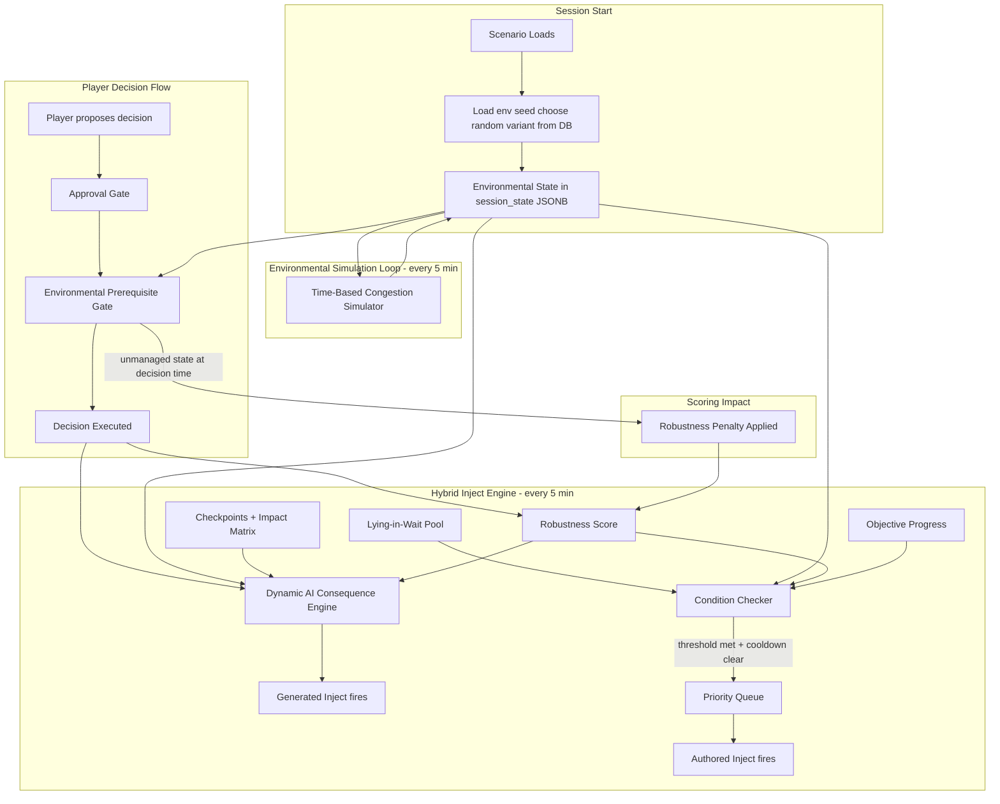
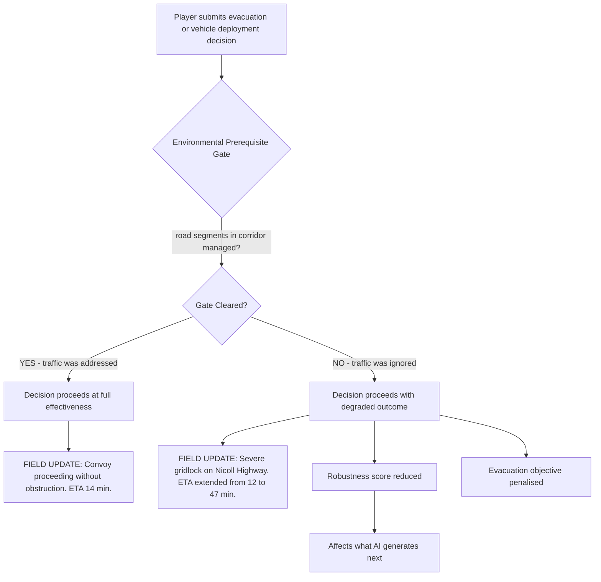
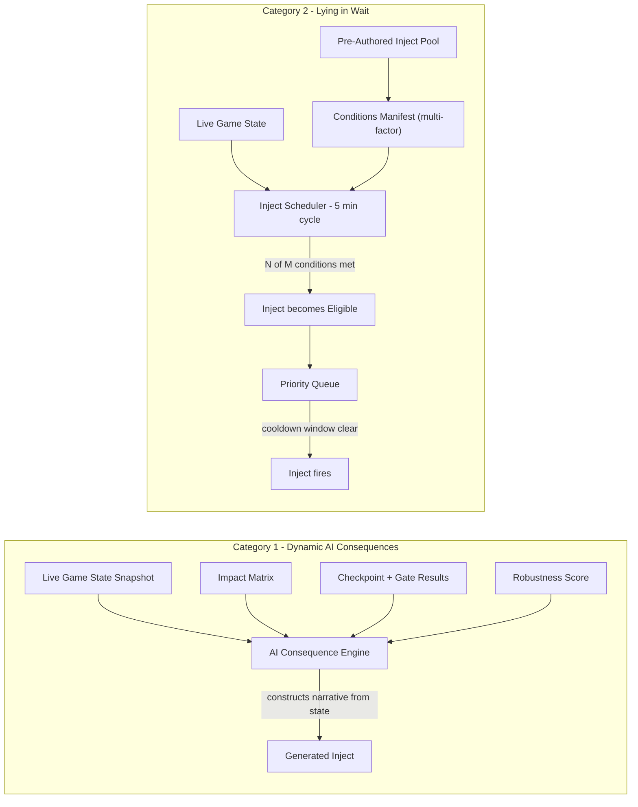
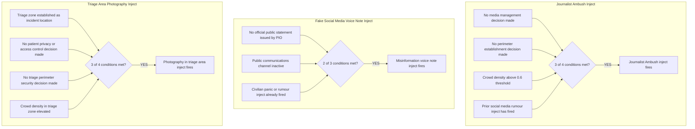
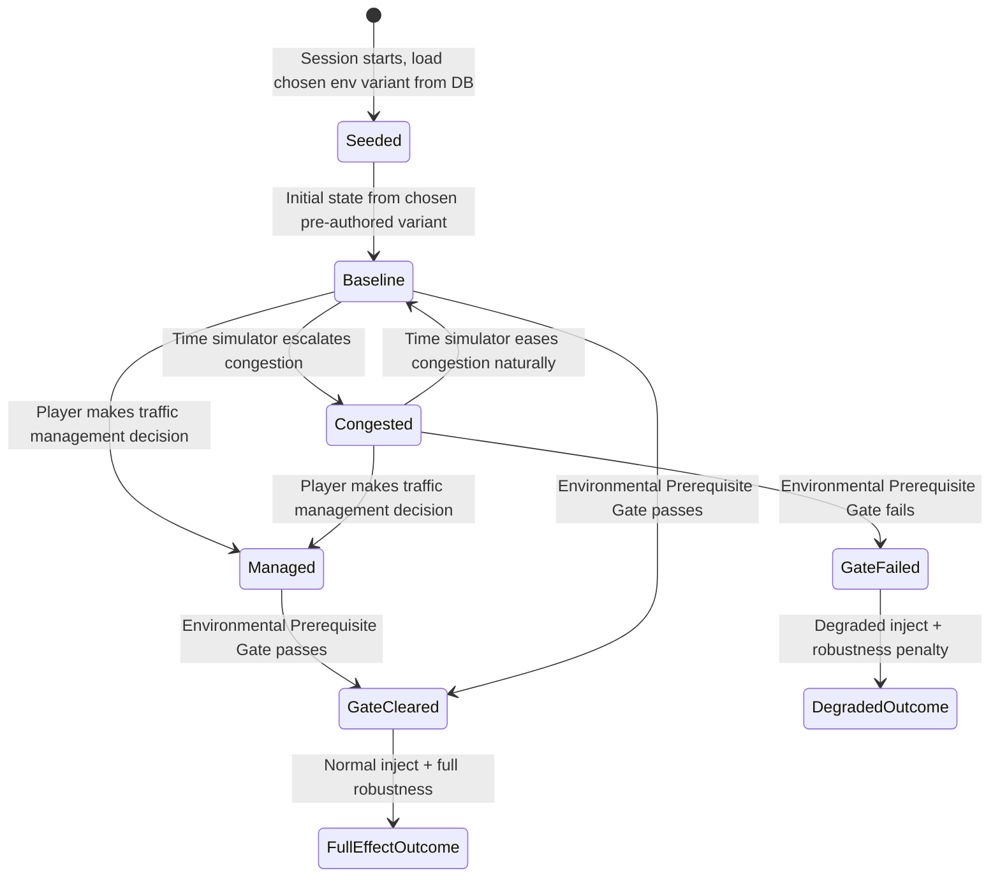

# Environmental & Hybrid Inject System — Design Overview

This document captures two interconnected game design ideas:

1. **Environmental State Layer** — ambient real-world conditions (traffic, crowd density, terrain) that exist independently of player decisions and silently penalise teams who ignore them before taking consequential actions.
2. **Hybrid Inject Engine** — a replacement for purely time-based inject scheduling, combining a dynamic AI consequence engine with a "lying-in-wait" pool of pre-authored injects that fire only when the game world reaches the right conditions (the perfect storm).

---

## Diagram 1 — Overall System Architecture

How the two new systems connect to the existing game loop.

---

## Diagram 2 — Environmental Prerequisite Gate

What happens when a player sends evacuation orders or emergency vehicles without managing traffic first. The gate does not hard-block the action — it determines whether the outcome is full effectiveness or degraded effectiveness.

---

## Diagram 3 — Hybrid Inject Engine Detail

The two categories of injects and their distinct trigger logic. Category 1 is generated dynamically by AI from the live game state. Category 2 is pre-authored by scenario designers and sits dormant until the world reaches the right conditions.

---

## Diagram 4 — Perfect Storm Conditions for Key Authored Injects

The multi-factor conditions that unlock each of the three critical "patience-testing" injects. A threshold model (N of M) is used so that a single technicality does not permanently block a contextually correct inject.

---

## Diagram 5 — Traffic State Lifecycle

How environmental state is loaded at session start (from a chosen pre-authored variant) and, optionally, evolves over simulated time — and how each state affects gate outcomes.

---

## Key Design Principles

**Environmental state is ambient, not reactive.** Traffic congestion evolves on its own timeline regardless of player actions. It is the player's responsibility to notice and manage it — the game does not prompt them to do so.

**Gates degrade, they do not block.** Failing an environmental prerequisite gate never prevents an action from being taken. It determines which version of reality follows from that action. Players can always act; they just live with the consequences of acting without preparation.

**Authored injects are timed by context, not by clock.** The "perfect storm" model means that scenario designers write the most instructionally rich injects once, with intent, and the engine surfaces them at the moment they will have the greatest training impact — when the game world has organically created the conditions for them.

**AI handles the mechanical; humans handle the human.** Dynamic AI consequences cover cause-and-effect logic (delays, resource depletion, cascade incidents). Pre-authored injects cover human behavioural dynamics (journalists, misinformation, public panic) that require crafted narrative to land correctly.

**Priority queuing prevents cascade overload.** If multiple lying-in-wait injects become eligible simultaneously, the one with the most conditions met fires first. A cooldown window prevents the next eligible inject from firing immediately after, preserving the instructional weight of each individual event.

---

## Implementation

For a step-by-step implementation plan (database, environmental state service, condition evaluator, inject engine, environmental gate, map, scenario data, cleanup), see [IMPLEMENTATION_ROADMAP.md](IMPLEMENTATION_ROADMAP.md). Per-step specifics live in [roadmap/](roadmap/).
