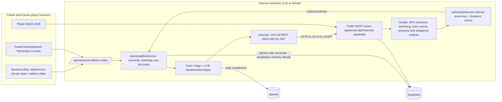

# AI Teammate Bots for the Corporate Crisis Module — Spec Sheet and Implementation Plan

Status: **built (Phases 0–6), September 2026.** The sections below are the design as approved; where the build deviated, the deviation is recorded in section 18 ("Findings") rather than rewritten, so the reasoning trail survives. Section 19 is the operating guide.

Scope: the social media / corporate crisis module only (`sessions.sim_mode = 'social_media'`, scenario `category = 'social_media_crisis'`). Field-ops is out of scope; it already has in-process bots (`server/services/demoAIAgentService.ts`).

Revision note: v1 of this plan was a laptop CLI. The user chose lobby-native bots from the start, plus a single session-wide intellect slider. This revision supersedes v1; the CLI survives only as an optional dev harness in Phase 6.

---

## 1. Problem, goals, non-goals

**Problem.** The module needs a staffed organisation (Communications, Legal, Shareholder Engagement, Stakeholder Engagement, plus custom teams) to exercise cross-team flows: Legal review gating publication, team-scoped injects, per-recipient email routing, intel forwarding, team scoring, AAR. A single developer cannot occupy those seats.

**Goals.**

- StarCraft-style lobby: the trainer adds an AI player to any team with one click, removes it with one click, and sets **one slider** ("Bot intellect", 0–100) that governs every bot in the session. No terminal, no laptop process.
- Bots are indistinguishable from humans to the game engines: they act only through the public HTTP API with real Supabase JWTs, so grading, NPC reactions, watchdog, team scores, notifications and AAR behave exactly as for a person.
- Bots run inside the backend (local or Render), survive restarts by reconciling from the database, and stop when the session completes.
- Bots stay in lane per the team charter the game itself serves them and complete the charter's expected actions so team scoring is meaningful.
- Bot skill is one continuous parameter with a deterministic, unit-tested mapping to behaviour.

**Non-goals.**

- No human "red team": the opposition is already automated (`antagonistEngineService`, `pressureEngineService`, `extremistHiveService`, NPC repliers). `POST /api/social/pages/session/:id/assign` refuses antagonist pages; bots never touch them.
- No per-bot skill control in v1 (one slider for all — user decision). Per-bot overrides are a possible later addition and the data model leaves room (see D8).
- No changes to the scenario wizard / WarRoom. Bots are a per-session staffing decision, not a scenario property (section 12).
- No browser automation, no video (that is `demo-run/`).

**Acceptance for the whole feature.** From the lobby, a trainer adds 3–4 bots to the unstaffed teams, sets the slider to 80, presses Start, and plays one team from a normal device. In a 30-minute session: an official statement lands inside the watchdog window, a Legal-reviewed draft exists, a press/regulator email is answered, misinformation is flagged/disputed, cross-team chat happens, every staffed team has a non-null composite in `GET /api/social/team-scores/session/:id`, and the AAR `team_performance` block is populated. Restarting the server mid-session resumes the bots within one reconcile tick.

---

## 2. Existing assets and what is reused

- `demo-run/brain.ts` — LLM player brain (team lanes, novice/expert tuning, heuristic fallback, `decide()`). **Seed of `server/services/teammates/brain.ts`**, heavily revised (charter-driven lanes, triage-first, structured output, slider-driven parameters).
- `demo-run/lib.ts` — password sign-in with rate-limit backoff, `apiFetch` with 401 refresh, `assignOrgPage`, `sendDM`, `likePost`, `postComment`. **Reused for token minting and the self-call REST client.**
- `demo-run/agent.ts` — Playwright UI executor. **Not reused**; its action vocabulary is the starting list.
- `loadtest/setup.ts` `registerParticipants()` — service-role upsert into `session_participants`. **Reused for enrolment** (bots are enrolled server-side; the join-link path is unnecessary in-process).
- `server/services/demoAIAgentService.ts` — in-process agent lifecycle (`start/stop/isRunning`, `getWebSocketService().onSessionEvent` subscription, proactive timer, `loadOwnEvaluatorFeedback`, classify-first). **Pattern reused; no code shared.**
- `server/services/engineTicker.ts` — 60 s reconcile loop over in-progress social sessions with `inFlight` guard. **Pattern reused for the bot reconciler.**
- `server/services/demoActionDispatcher.ts` `enqueueEvaluation()` — sequential LLM queue to avoid rate-limit bursts. **Pattern reused for the global LLM queue.**
- `migrations/147_demo_bot_accounts.sql` — fixed-UUID bot auth users at `@blackswan.internal`. **Convention reused for the teammate bot account pool.**
- `frontend/src/components/SimDevice/AdversaryConsole.tsx` — trainer console for AI-run opposition pages. **UI pattern mirrored by the Teammate Console (Phase 6).**

`demo-run/` is currently untracked in git. Commit it first so the seed is versioned (Phase 0).

---

## 3. Architecture

Bots are ordinary participants with real auth users. The game routes never know they are bots; only the lobby/dashboard read `user_profiles.is_bot` for badges. The bot runner lives in the same Node process as the API and calls it over loopback, so every side effect is identical to a human's request.

---

## 4. Design decisions and rejected alternatives

- **D1 — HTTP-only actor, in-process, over loopback.** `POST /api/social/posts` (`server/routes/socialMedia.ts` ~L312–700) carries ~400 lines of inline side effects (grading, `snapshotTeamScores`, `triggerNPCReactions`, consequence injects, media generation, `surfacePostToSession`, notifications, `recordPlayerAction`). A dispatcher writing to Supabase directly would duplicate them and drift (`demoActionDispatcher.ts`, 54 KB, is the cautionary example). The runner therefore calls `http://127.0.0.1:${env.port}` with a bot JWT. _Rejected:_ direct DB writes; refactoring route handlers into services first (bigger, riskier refactor — remains a future option that would let the executor call services directly with no transport change elsewhere).
- **D2 — Runner lives in the backend process, not a separate worker or laptop.** User requirement (lobby button, no terminal). State is reconciled from DB every 60 s, so a Render deploy or crash resumes bots automatically (same shape as `engineTicker`). _Rejected:_ separate Render Background Worker (more infra, same code); laptop CLI (v1 of this plan).
- **D3 — Bot JWTs via password sign-in with the service-role client.** `requireAuth` validates with `supabaseAdmin.auth.getUser(token)` (`server/middleware/auth.ts` L32), so tokens must be Supabase-issued. Bot accounts share a password from `TEAMMATE_BOT_PASSWORD`; at boot the service asserts it with `auth.admin.updateUserById(id, { password })` so the migration never contains the secret. Tokens cached in memory; refreshed with the refresh token; re-minted on failure with backoff (Supabase throttles password sign-ins ~30 per 5 min per IP; a pool of 16 accounts is well within that). _Rejected:_ minting HS256 JWTs locally (no `SUPABASE_JWT_SECRET` in env); magiclink `generateLink` + `verifyOtp` (works, more exotic; keep as fallback note).
- **D4 — Fixed pool of bot accounts created by migration.** 16 auth users `teammate-bot-01..16@blackswan.internal` with fixed UUIDs, personas and Singaporean names (from `demo-run/config.ts`), `user_profiles.is_bot = true`, `role = 'participant'`. A session picks unused pool members; the same account may sit in different sessions concurrently (participation is per session). _Rejected:_ creating accounts on demand (slower, non-deterministic names, auth rate limits).
- **D5 — Enrolment is server-side and direct.** `POST /api/sessions/:id/bots` writes `session_participants(role='participant')`, `session_teams`, `demographics`, `is_ready=true` with the service role, then calls `ensureTeamChannels` and `invalidatePlayerTeamCache` exactly as `routes/join.ts` and `routes/teams.ts` do. _Rejected:_ join-link self-call (IP-keyed 10/min limiter, needs `join_enabled`); `POST /api/sessions/:id/participants` (its `role` enum is field-ops only, `server/routes/sessions.ts` L1624).
- **D6 — `is_bot` flag on `user_profiles`, `bot_intellect` on `sessions`.** `GET /api/sessions/:id` already returns `session_participants(*, user:user_profiles(*))` (L85), so the badge propagates to the lobby, `ParticipantManagement`, `TeamAssignmentModal` and the ledger with no new endpoint. `sessions.bot_intellect smallint` (0–100, default 70, nullable) is the single slider. Both columns are additive and nullable/defaulted. _Rejected:_ per-session bot table (redundant with `session_participants` + `is_bot`); storing the slider in `current_state` JSON (not queryable, easy to clobber).
- **D7 — Charter-driven lanes from the game.** Bots read `GET /api/social/my-team/session/:id` (team_name, function_key, mission, responsibilities, out_of_lane, task descriptions). High intellect additionally reads hidden `expected_actions` (timings, weights) from `scenario_teams.charter` via service role. Works for custom teams and legacy team names.
- **D8 — One intellect slider mapped to a parameter set.** `intellectToParams(n: 0..100)` is a pure function producing: cadence range, reaction delay, counter rate, idle rate, fact discipline, lane discipline, coordination, knows-rubric, critique pass, model tier. Anchors at 0 / 30 / 60 / 85 / 100 with linear interpolation; labelled bands on the slider: Novice (0–24), Competent (25–49), Proficient (50–74), Expert (75–100). Live-adjustable mid-session; each bot reads the session value at the start of every turn. The data model leaves room for a future per-bot override column but v1 exposes none (user decision).
- **D9 — Triage-first planner, LLM writes.** Deterministic code builds a prioritised to-do list; the LLM chooses among the top items and writes copy, with structured outputs (JSON schema) so malformed replies never silently fall back. _Rejected:_ single free-form LLM pick (current `demo-run/brain.ts`).
- **D10 — Reactivity from the internal event bus.** In-process, bots subscribe with `getWebSocketService().onSessionEvent(sessionId, handler)` (the same internal bus `demoAIAgentService` uses), so no Socket.io client is needed. Per-user events (`emitToUser`) are not on the session bus; email/DM arrival is detected on the next poll or via the session-level `sim_email.received` / `messenger.received` broadcasts where they exist.
- **D11 — Feature flag and budget guards.** `ENABLE_TEAMMATE_BOTS` (default: on in dev, off in production until stable, same pattern as `enableScenarioDirector`), `TEAMMATE_BOTS_MAX_PER_SESSION` (default 8), `TEAMMATE_BOTS_MAX_LLM_PER_HOUR` per session (default 400), one global sequential LLM queue with a small inter-call pause.

---

## 5. Data model (migration `207_teammate_bots.sql`)

- `ALTER TABLE user_profiles ADD COLUMN is_bot boolean NOT NULL DEFAULT false;`
- `ALTER TABLE sessions ADD COLUMN bot_intellect smallint DEFAULT 70 CHECK (bot_intellect BETWEEN 0 AND 100);`
- Insert 16 `auth.users` rows (fixed UUIDs `b0000000-7e00-b000-0001-0000000000NN`, emails `teammate-bot-NN@blackswan.internal`, `raw_user_meta_data` with `full_name`, `username`, `role='participant'`, `agency_name='AI Teammate'`, placeholder `encrypted_password` replaced at boot per D3), `ON CONFLICT (id) DO NOTHING`; the `handle_new_user()` trigger creates `user_profiles`; then `UPDATE user_profiles SET is_bot = true WHERE id IN (...)`.
- No new tables. Bot membership = `session_participants` rows whose user is a bot. Team = `session_teams`. Page holder = `session_page_controllers`.
- RLS: `user_profiles` is already readable where needed; `is_bot` inherits. No policy changes.
- Rollback: `DROP COLUMN` both (safe, nothing else depends on them); the auth users may stay (harmless, cannot log in without the env password).

---

## 6. Server: service and routes

### 6.1 `server/services/teammates/` module

- `teammateBotService.ts` — singleton. `startReconciler()` on boot (called from `server/index.ts` next to `startGeneratorEngines()`); every 60 s: for each `sessions.status='in_progress' AND sim_mode='social_media'` with bot participants, ensure a `SessionBots` runtime exists; for finished sessions, stop and drop. Also exposes `onBotsChanged(sessionId)` for immediate start/stop after lobby edits and session status changes (hooks in `PATCH /api/sessions/:id` where `status === 'in_progress' && previousStatus === 'scheduled'`, L1599, and on `completed`/`cancelled`, L1524).
- `accounts.ts` — pool definition (UUIDs, names, personas), `ensurePasswords()` at boot, `getToken(botUserId)` with cache/refresh/backoff.
- `enrol.ts` — `addBot(sessionId, teamName, trainerId)`, `removeBot(sessionId, botUserId)`, page-holder logic (auto-assign the first Communications bot only if `sim_org_pages` protagonist page has no controller at start; never override a human).
- `apiClient.ts` — typed loopback REST client (all endpoints in sections 7 and 8), one mutating call per turn, 5xx backoff.
- `perception.ts`, `triage.ts`, `brain.ts`, `memory.ts`, `executor.ts`, `bot.ts` (`PlayerBot` loop), `intellect.ts` (`intellectToParams`), `llmQueue.ts`.
- Runtime state per session: bots map, team blackboards, event handler, timers, LLM budget counters, `stopped` flag. Rebuilt from DB on resume (section 9.3).

### 6.2 Routes `server/routes/teammateBots.ts`, mounted at `/api/sessions/:id/bots` (trainer or admin; session owner via `assertSessionOwner`)

- `GET /` → `{ enabled, intellect, max_per_session, bots: [{ user_id, display_name, team_name, status: 'idle'|'acting'|'paused'|'stopped', last_action, actions, failures }] }`.
- `POST /` `{ team_name }` → validates team exists in the scenario (same check as `routes/teams.ts` L155–168), pool has a free member, per-session cap not exceeded, session not completed; enrols; broadcasts `participant.ready_status_updated` (reuse the existing ready-status computation so the lobby updates live); returns the participant row with `user`.
- `DELETE /:userId` → stops the bot loop if running, deletes `session_participants` (cascades `session_teams`, `session_page_controllers`), broadcasts ready status.
- `PATCH /settings` `{ intellect: 0..100 }` → updates `sessions.bot_intellect`; running bots pick it up next turn; broadcasts `teammate_bots.settings_updated`.
- `POST /:userId/pause`, `POST /:userId/resume`, `POST /:userId/nudge { text }` (Phase 6) — nudge posts the trainer's instruction into the bot's team chat channel attributed to the trainer, which the bot reads as a high-priority mention.
- All routes return 404 when `ENABLE_TEAMMATE_BOTS` is off so the UI hides the section.

### 6.3 Guards

- Bot tokens are never used for trainer routes; enrolment and page assignment use the service role inside the service, not the API.
- Antagonist/pressure pages are never assignable to bots (existing server check plus a service-level assertion).
- Bots are never added to non-social sessions or completed sessions.
- Content guard before any public post: fact-sheet-bounded claims at intellect ≥ 50; profanity/slur filter at all levels; ≤ 2000 chars; `@mentions` stripped unless they resolve to a known handle.

---

## 7. Perception layer (what a bot reads each turn)

All GETs use the bot's own JWT so server-side visibility filtering (team-scoped injects, per-recipient emails, country scope) applies exactly as for a human.

- Feed: `GET /api/social/posts/session/:id` — x_twitter + facebook, newest 40, plus every post with `requires_response && !responded_at` and every post whose `content_flags` mark misinformation/hate/incitement/organised pressure; track `virality_score`, `author_type`, `reply_count`.
- Emails: `GET /api/social/emails/session/:id` — unread inbound to me, threads I have not replied to, `delivery_config.intel_key` presence, sender address, deadline phrases in body.
- DMs: `GET /api/social/messenger/threads/:id?platform=facebook` — threads whose last message is not mine (to my handle or to the page I control).
- Team chat: `GET /api/channels/session/:id` → my `type='team'` channel (`team_name` match) plus `inter_agency`; `GET /api/channels/:channelId/messages` newest 30; detect mentions/questions and trainer nudges.
- Drafts: `GET /api/drafts/session/:id` — `in_review` drafts on my team where `author_id !== me`; my own drafts by status.
- Charter: `GET /api/social/my-team/session/:id` at start and on `team_scores.updated`.
- SOP: `GET /api/social/sop/session/:id` at start.
- Gauges: `GET /api/social/state/session/:id`.
- News: `GET /api/social/news/session/:id`; `POST /api/social/news/:articleId/read` → `news_read`.
- Contacts/handles: `GET /api/social/contacts/session/:id`, `GET /api/social/handles/session/:id`, `GET /api/social/emails/contacts/session/:id`.
- Own activity and grades: `GET /api/social/my-activity/session/:id`; `social_posts.sop_compliance_score`, `player_drafts.last_grade`.
- Slider: `sessions.bot_intellect` (service role, cached 10 s).

The situation report is compacted to ~2–3 KB: counts, top 8 feed items with tags (`FALSE-CLAIM`, `HATE`, `NEEDS-RESPONSE`, `HANDLED-BY-TEAM`), unanswered emails/DMs with age, pending review drafts, last 6 chat lines, gauge deltas, my open commitments.

---

## 8. Action catalogue (executor contract)

Each action is one loopback API call and produces the `player_actions.action_type` shown (closed vocabulary `ALLOWED_DETECTION_ACTION_TYPES`, `server/services/teamCharterService.ts` L49). Lane rules are enforced in code before the LLM is consulted.

- `statement` → `POST /api/social/posts { session_id, content, platform:'x_twitter', post_format:'official_statement', post_as_page:true }` → `post_created` (publish step). Page holder only.
- `post` → same with `post_as_page:false, post_format:'text'` → `post_created`. Public-voice team only at intellect ≥ 25; any team below (deliberate out-of-lane).
- `reply` → `POST /api/social/posts { reply_to_post_id, content, platform: parent.platform }` → `reply_posted` (+ `assess` when parent is harmful); surfaces targeted posts.
- `flag` → `POST /api/social/posts/:postId/flag` → `post_flagged` / `misinfo_flagged`.
- `report` → `POST /api/social/posts/:postId/report { violation_category, reason_text }` → `post_reported`; only on genuinely harmful `content_flags`.
- `like` / `repost` → `POST /api/social/posts/:postId/like` / `/repost`; never on harmful content at intellect ≥ 25.
- `dispute` → `POST /api/social/disputes { session_id, target_type:'post'|'article', target_id, claimed_falsehood, submitted_facts }` → `dispute_filed` (max 5 pending per player).
- `email_read` → `POST /api/social/emails/:emailId/read` → `email_read`; always before replying.
- `email_reply` → `POST /api/social/emails { session_id, to_addresses:[sender], subject:'Re: …', body_text, replied_to_id }` → `email_sent`.
- `email_forward` → `POST /api/social/emails { to_addresses:[teammate sim address], forwarded_email_id, body_text }` → `email_sent` and, when the recipient's team needs that intel, `intel_shared`.
- `dm_reply` → `POST /api/social/messenger/send { session_id, recipient_handle, content, platform:'facebook', send_as_page? }` → `dm_sent`.
- `draft_create` → `POST /api/drafts { session_id, title }` then `PATCH /api/drafts/:id { content_html }` → `draft_created`.
- `draft_submit` → `POST /api/drafts/:id/submit` → `draft_submitted_for_approval`.
- `draft_review` → `POST /api/drafts/:id/review { verdict, note }` → `draft_approved` on approve (server: reviewer must be a teammate, not the author).
- `chat` → `POST /api/channels/:channelId/messages { content, message_type:'text' }` → `chat_message_sent`.
- `fact_check` / `escalate` → `POST /api/social/action { session_id, action_type:'fact_checked'|'escalated', target_id, content }`.
- `idle` → no call.

---

## 9. Brain: intellect mapping, triage, prompting, memory, coordination

### 9.1 `intellectToParams(n)` (pure, unit-tested in `intellect.test.ts`)

- Anchor 0 (Novice floor): cadence 150–300 s, reaction delay 180–360 s, counterRate 0.05, idleRate 0.5, factDiscipline 0.1, laneDiscipline 0.2, coordination 0.05, knowsRubric false, critiquePass false, model tier fast.
- Anchor 30: cadence 110–240 s, reaction 120–300 s, counterRate 0.25, idleRate 0.35, factDiscipline 0.4, laneDiscipline 0.5, coordination 0.3, knowsRubric false, critiquePass false, fast.
- Anchor 60: cadence 60–120 s, reaction 60–150 s, counterRate 0.7, idleRate 0.15, factDiscipline 0.8, laneDiscipline 0.9, coordination 0.7, knowsRubric true, critiquePass false, strong model for statements/legal.
- Anchor 85: cadence 35–80 s, reaction 30–90 s, counterRate 0.95, idleRate 0.08, factDiscipline 1.0, laneDiscipline 1.0, coordination 0.95, knowsRubric true, critiquePass true, strong.
- Anchor 100: cadence 30–60 s, reaction 20–60 s, everything at ceiling, critique pass on all public artefacts.
- Booleans switch at the anchor where they first become true; numbers interpolate linearly between anchors.
- Slider labels in UI: Novice / Competent / Proficient / Expert with a short one-line description under the thumb (e.g. "Slow, vague, off-lane, ignores misinformation" at Novice; "Fast, fact-led, in lane, coordinates and reviews before publishing" at Expert).

### 9.2 Deterministic triage (highest first)

1. Draft `in_review` on my team awaiting a reviewer → `draft_review` (Legal function prioritised).
2. Trainer nudge or human mention in team chat addressed to me → `chat` or the requested action.
3. Inbound email addressed to me, unanswered, ordered by explicit deadline then age → `email_read` + `email_reply`.
4. DM to me or to my page, unanswered → `dm_reply`.
5. Intel email I hold whose `intel_needed_by` team has a member → `email_forward`.
6. Harmful post nobody on the team has countered (blackboard), by virality → public-voice team: `reply`; Legal: `dispute`/`report` + `chat` escalation; others: `flag` + `chat`.
7. Charter task not yet done whose benchmark is within 5 min (knowsRubric only) → the matching action type.
8. Page holder: no official statement yet and elapsed ≥ 3 min, or gauges falling and last statement > 15 min old → `draft_create`/`draft_submit` (if Legal is staffed) else `statement`.
9. Otherwise monitoring: `read_news`, `email_read`, `like` (benign supportive posts), `idle` per idleRate.

Low intellect skips 1, 5, 7, 8 most of the time (via counterRate/coordination/idleRate), ignores deadlines, and may pick out-of-lane `post`.

### 9.3 LLM contract and memory

- System prompt: identity and persona; charter; SOP summary; fact sheet (`initial_state.fact_sheet.confirmed_facts`, `unconfirmed_claims`) and `research_guidelines`; intellect-band rules; when `knowsRubric`: the grading dimensions the game uses (accuracy, tone, cultural sensitivity, persuasiveness, completeness, clarity; official statements add authority and call-to-action; role fit) and the watchdog posture ladder (reactive → defensive → accommodative → proactive; consistency; T+20/T+35 silence penalties).
- User prompt: situation report, triage shortlist (top 3 with ids), open commitments, last grades with `improvements`.
- Output (JSON schema, strict): `{ action, target_id, text, subject, to, verdict, reason }`, `action` constrained to the lane-allowed set. Invalid output → template action for the triage's top item; counted in `brainStats.fallbacks`.
- Critique pass (`critiquePass`): for `statement`, press/regulator `email_reply`, `draft_review`: second call scores against the same dimensions and revises once. Optional `TEAMMATE_BOTS_PREGRADE=true` uses `POST /api/social/grade` as critic (off by default; inflates scores relative to humans).
- Per-bot memory: sent posts/emails/DMs with timestamps; commitments (regex/LLM-extracted due times); handled target ids; last 5 grades with `improvements`; cited facts. Rebuilt on resume from `GET /api/social/my-activity` and own rows in `social_posts`, `sim_emails`, `player_drafts`.
- Team blackboard (per session, shared by bots on the same team): claimed targets with TTL, plan, page holder. Mirrored to the team chat as short human-readable lines so the human teammate sees it and can override in chat.

### 9.4 Coordination protocols

- Publish gate: Legal staffed (human or bot) → Comms drafts → submits → Legal reviews → Comms publishes the approved text as `statement`. Legal unstaffed → publish directly, note in chat.
- Intel relay: forward intel emails to the needing team within the next turn.
- Escalation: legal-risk content is never answered publicly by non-public-voice teams; forward to Legal or raise in chat.
- Consistency: before a `statement`, re-read prior statements from memory; instruct the LLM to honour commitments and never contradict them.
- Human precedence: if the human already replied (`responded_at`, thread state, chat), release the claim.

---

## 10. Frontend

### 10.1 Session lobby (`frontend/src/components/Session/SessionLobby.tsx`, trainer-only, social sessions only, hidden when the API returns 404)

- New "AI teammates" card between the ready-status card and the join-link panel:
  - Header row: title, count `n / max`, and the **Bot intellect** slider (0–100, band label + one-line description, debounced `PATCH /settings`). One slider for the whole session.
  - Per scenario team (from `GET /api/teams/scenario/:id` or the session's team list): team name, human count, bot chips (name + BOT badge + remove x), and an "+ Add bot" button (disabled at cap or when the session is completed).
  - Bots also appear in the existing "Team assignments" grid and in `ParticipantManagement` / `TeamAssignmentModal` with a small BOT badge derived from `user.is_bot`, and remain reassignable/removable there.
- Ready status: bots enrol as ready, so the Start button gating is unaffected; the trainer's ready list shows them with the badge.
- Session start: no new UI; `PATCH /api/sessions/:id { status:'in_progress' }` triggers `onBotsChanged`.

### 10.2 Trainer dashboard (`frontend/src/components/SimDevice/TrainerSimDashboard.tsx`, Phase 6)

- "Teammate Console" panel mirroring `AdversaryConsole`: each bot with team, status, last action and time, actions/failures, pause/resume, nudge textbox; the same intellect slider, live.
- Player Judgement Ledger and Team Performance cards show a BOT badge next to bot members.

### 10.3 AAR (Phase 6)

- BOT badge on bot participants; optional "exclude bots" toggle on the ledger view (display-only filter, no scoring change).

---

## 11. Timing, limits, cost, resilience

- Cadence and reaction delays per intellect (9.1). One mutating call per bot per turn.
- Loopback traffic: ~10 GETs + 1 POST per turn per bot ≈ 15 req/min at high intellect — negligible; the general limiter is keyed per user (20k/15 min dev, 10k prod) so bots never starve humans.
- LLM: global sequential queue with a 1–2 s pause; per-session hourly budget (`TEAMMATE_BOTS_MAX_LLM_PER_HOUR`, default 400); when exhausted, bots run heuristics only until the window rolls. 4 bots at intellect 85 ≈ 5–6 calls/min including critique.
- Token lifetime 1 h → refresh on 401; re-mint on refresh failure with exponential backoff.
- Failure isolation: a bot's turn errors are logged and counted; three consecutive 5xx pause that bot 60 s; the session runtime never throws out of the reconciler.
- Restart: the reconciler recreates runtimes for in-progress sessions with bots within one tick; memory is rebuilt from DB (9.3). Bots may repeat a monitoring action after a restart but never re-publish a statement they already made (memory rebuild happens before the first turn).
- Render note: the bot loops add CPU/memory to the API process proportional to bot count; the per-session cap and global LLM queue bound this. If it proves heavy, the same module can move to a Render Background Worker unchanged (it only needs env and loopback → would switch `apiClient` base URL to the web service URL).

---

## 12. UX touchpoints summary (what changes where)

- Scenario wizard / WarRoom: **no change**. Bots read whatever `scenario_teams` charters the wizard produced. Team caps (`max_participants`) count bots; the lobby "+ Add bot" button is disabled when a team is at cap, with a hint to raise the cap in the wizard's Review step.
- Session lobby: **new AI teammates card** (10.1); existing roster/team/page modals gain a BOT badge.
- Player device: **no change**; bots are teammates in chat, mail, Docs review, feed.
- Trainer dashboard: **Teammate Console** (Phase 6).
- AAR: **BOT badge**, optional exclude toggle (Phase 6).
- Relationship to "AI-operated offices" (`flipUnstaffedOrgsToAi`): unchanged and complementary. An office with no humans is spoken for by the pressure engine as a page; a bot teammate is a seat inside a staffed organisation. Both may coexist in multi-org scenarios.

---

## 13. Testing

- Unit (node --test via tsx, added to the `npm test` list): `intellect.test.ts` (anchors, monotonicity, boolean switch points), `triage.test.ts` (ordering, lane gating per function key, human-precedence release), `brain.test.ts` (schema validation, fallback path), `enrol.test.ts` (pool selection, cap, team validation) with Supabase calls stubbed.
- Integration (manual, documented in `docs/ai-teammate-bots-plan.md` Findings): local server, real social scenario, 3 bots + 1 human, 30 min; server restart mid-session; slider change mid-session; remove a bot mid-session.
- Scorecard (Phase 6): `GET /api/social/team-scores`, ledger, gauges, `player_actions` counts per bot, time to first statement, % harmful posts countered within 5 min; `scripts/teammates-compare.ts` for run-to-run comparison.

---

## 14. Implementation phases (each independently shippable and revertible; commits prefixed `bots(phaseN):`)

### Phase 0 — Record and baseline

- Save this document to `docs/ai-teammate-bots-plan.md`; commit `demo-run/` as-is.

### Phase 1 — Foundations: migration, service skeleton, routes, lobby UI, MVP brain

- `migrations/207_teammate_bots.sql` (section 5).
- `server/env.ts`: `enableTeammateBots`, `teammateBotPassword`, `teammateBotsMaxPerSession`, `teammateBotsMaxLlmPerHour`, `teammateBotsModelFast`, `teammateBotsModelStrong`.
- `server/services/teammates/{teammateBotService,accounts,enrol,apiClient,intellect,llmQueue,brain,executor,bot}.ts`; reconciler started from `server/index.ts`; start/stop hooks in `PATCH /api/sessions/:id`.
- `server/routes/teammateBots.ts` (`GET /`, `POST /`, `DELETE /:userId`, `PATCH /settings`), mounted in `server/index.ts`.
- Lobby card with add/remove per team, slider, BOT badges (10.1).
- MVP brain: `demo-run/brain.ts` adapted, lanes from `/api/social/my-team`, actions `statement, post, reply, flag, like, repost, chat, read_news, email_read, idle`, intellect mapping wired.
- Acceptance: add 3 bots in the lobby of a human's session, set slider 80, press Start; bots act on the feed and in team chat for 15 min; team-scores non-null for their teams; `DELETE` removes one mid-session; restart the server, bots resume within 60 s.
- Rollback: set `ENABLE_TEAMMATE_BOTS=false` (routes 404, lobby card hidden, reconciler idle). Full revert: drop columns, remove module/routes/UI; pool auth users are inert.

### Phase 2 — Perception, triage, rubric-aware prompting, full action set

- `perception.ts`, `triage.ts`, revised `brain.ts` with structured outputs; adds `email_reply`, `dm_reply`, `dispute`, `report`, `fact_check`, `escalate`; hidden-charter read at `knowsRubric`; unit tests.
- Acceptance: press email answered within its benchmark; misinformation countered by the right team; no out-of-lane public posts at intellect ≥ 60 across 30 min; `brainStats.fallbacks` < 5 %.
- Rollback: env `TEAMMATE_BOTS_PLANNER=off` restores Phase 1 behaviour.

### Phase 3 — Coordination, drafts, intel, resume-from-DB

- `memory.ts` (per-bot memory + team blackboard), executor support for `draft_create/submit/review` and `email_forward`, publish gate, chat mirroring, memory rebuild on resume.
- Acceptance: a Comms bot's draft is approved by a Legal bot before the statement is published (`draft_approved` recorded); intel forward yields `intel_shared`; two bots on one team never counter the same post; after a restart no statement is duplicated.
- Rollback: `TEAMMATE_BOTS_COORDINATION=off`.

### Phase 4 — Event-driven reactivity

- Subscribe per session via `getWebSocketService().onSessionEvent`; wake on `inject.published`, `social_post.created` (harmful flags), `sim_email.received`, `messenger.received`, `message.sent` (mention in my channel), `team_scores.updated`, `session.*`; reaction delay per intellect.
- Acceptance: median reaction to a targeted email under 90 s at intellect ≥ 85 vs cadence-bound before.
- Rollback: `TEAMMATE_BOTS_REACTIVE=off`.

### Phase 5 — Feedback loop and critique/revise

- Own grades into memory and prompt; critique pass per `critiquePass`; optional pregrade.
- Acceptance: average `overall` of statements at intellect 85 rises vs Phase 4 baseline on the same scenario; fallbacks do not increase.
- Rollback: `TEAMMATE_BOTS_CRITIQUE=off`.

### Phase 6 — Trainer console, AAR badge, scorecard, optional CLI

- Teammate Console panel (10.2) with pause/resume/nudge routes; AAR badge and exclude toggle; `scripts/teammates-scorecard.ts` + `compare.ts`; optional `scripts/teammates-cli.ts` that runs the same `PlayerBot` out-of-process against any base URL for local debugging.
- Acceptance: two runs of the same config produce comparable scorecards; first baseline recorded in the doc.

---

## 15. Risks and open questions

- Loopback self-calls on Render: the web service must accept connections on `127.0.0.1:${PORT}` from itself (standard); if a platform ever blocks it, switch `apiClient` base URL to the public service URL.
- Supabase password sign-in throttling if many sessions start at once: token cache across sessions (accounts are shared) keeps mint rate low; backoff otherwise.
- `bot_intellect` is per session; a trainer running two concurrent sessions sets each separately (by design).
- Email deadlines are not a first-class field; detection is best-effort from body text.
- Team caps can block adding bots; the UI explains and the wizard is the place to raise them.
- Process load on Render at high bot counts; bounded by `TEAMMATE_BOTS_MAX_PER_SESSION` and the LLM queue; worker split is the escape hatch (section 11).
- `GET /api/social/intel-status` may be trainer-only; the service reads via service role where needed.

---

## 16. File map (new or touched)

- `migrations/207_teammate_bots.sql` — new.
- `server/env.ts` — flags and settings.
- `server/index.ts` — mount `teammateBotsRouter`; start reconciler.
- `server/routes/sessions.ts` — two hook calls on status transitions.
- `server/routes/teammateBots.ts` — new.
- `server/services/teammates/*.ts` — new module (service, accounts, enrol, apiClient, intellect, llmQueue, perception, triage, brain, memory, executor, bot) and tests.
- `frontend/src/components/Session/SessionLobby.tsx` — AI teammates card; badges in `ParticipantManagement.tsx`, `TeamAssignmentModal.tsx`.
- `frontend/src/components/SimDevice/TrainerSimDashboard.tsx` — Teammate Console (Phase 6).
- `frontend/src/components/AAR/*` — badge/toggle (Phase 6).
- `scripts/teammates-scorecard.ts`, `scripts/teammates-compare.ts`, `scripts/teammates-cli.ts` — Phase 6.
- `docs/ai-teammate-bots-plan.md` — this document plus Findings.

## 17. Backtracking guide

- Behavioural regressions: flip the phase env flag (`TEAMMATE_BOTS_PLANNER/COORDINATION/REACTIVE/CRITIQUE`) before reverting code; each phase is a separate commit.
- Kill switch: `ENABLE_TEAMMATE_BOTS=false` disables routes, UI and reconciler without touching data.
- Regret on D1 (transport): only `apiClient.ts`/`executor.ts` change; brain, triage, memory are transport-agnostic.
- Regret on D2 (in-process): move `server/services/teammates/` to a worker entry point and point `apiClient` at the web service URL; routes stay.
- Regret on D8 (single slider): add a nullable `bot_intellect_override smallint` to `session_participants` and read it before the session value; UI gains a per-chip control.
- Regret on D4 (fixed pool): add on-demand creation in `accounts.ts`; the rest keys off `is_bot`.
- Scenario changes (team names, charter fields): bots read from `/api/social/my-team` and `scenario_teams`; if `ALLOWED_DETECTION_ACTION_TYPES` gains a type, add one case in `executor.ts`.

---

## 18. Findings (build record, September 2026)

Deviations from the approved design, and what the first live runs showed. Each item names the section it amends.

**Amends D3/D4 and §5 — bot accounts are created through the Admin API, not by migration.** Migration `207_teammate_bots.sql` adds only the two columns (`user_profiles.is_bot`, `sessions.bot_intellect`). The sixteen pooled accounts are created lazily by `server/services/teammates/accounts.ts` with `auth.admin.createUser` on first use, then the profile is asserted every boot (`role='participant'`, `is_bot=true`, display name, agency "AI Teammate"). Reason: hand-written `auth.users` rows (the migration-147 pattern) leave GoTrue string columns null, which breaks password sign-in; migration 147 got away with it only because those bots never log in. Identity is by `user_profiles.username` (`teammate.bot.NN`), so fixed UUIDs were unnecessary. Password drift is self-healing: an "invalid credentials" sign-in triggers `updateUserById` with the env password and one retry.

**Amends §6.2 — `validate()` replaces `req.params`.** `server/lib/validation.ts` writes the parsed object back over `req.params`, so any params schema on the merged router must list the session `id` alongside `userId`, or the owner guard sees no session id. Recorded because it is an easy trap for future routes mounted with `mergeParams`.

**Amends §9.3 — a session-wide claims board was added next to the per-team board.** First smoke run: an "URGENT: Leak of crisis plan" email from General Counsel was delivered session-wide (no `recipient_user_ids`) and all three bots, on three different teams, each answered it within a minute. Per-team blackboards cannot see each other, so a runtime-level board (`sessionBoard`) now records claims on emails and DMs; triage checks both boards. Humans are still not covered by this: a bot cannot see a human teammate's reply to an NPC email (the emails route only exposes another player's outbound mail when it is addressed to you), so bot-after-human duplicate replies remain possible. Candidate fix if it bites: surface `replied_to_id` of any outbound email in the same session to participants, or track responded emails on `sim_emails`.

**Amends §9.2 — the "no statement yet" item outranks urgent inbox items.** In the first run the page-holding Communications bot spent its first turns on plan chat, one rebuttal and two urgent emails, and had not published a holding statement at T+7. Priority for the no-statement case moved from 25 to 21 (above urgent emails at 22). One action per turn at ~40–90 s cadence means the first statement still lands around T+3–5 at intellect 80, which is inside the watchdog window.

**Amends §9.2 — triage randomness is drawn through named rolls.** `triage()` takes a `TriageRolls` object (`idle`, `counter`, `neglect`, `mischief`) instead of a single `rng`, so tests can pin each behaviour independently and production keeps `Math.random` for all four. Discovered while writing `triage.test.ts`: with one shared rng a value that "never trips" the counter gate also silently switched on the idle filter.

**Amends §5 — resume also rebuilds chat state.** After a restart the in-memory board is empty, and in the restart test the team lead re-posted a TEAM PLAN. `PlayerBot.resumeBoardFromChat` now seeds `lastChatAt` and the board's plan from the team channel's recent messages before the first post-restart turn. Statements, replied emails and handled targets were already rebuilt from the database and did not duplicate (verified: the two "MY regulator bulletin" replies in the restart session were to two different inject emails).

**Confirmed working (smoke sessions `99289aee…` and `dbbb4430…`, VacuumGate SEA scenario, local server on :3021).**

- Lobby flow: add three bots to three teams, slider to 80, ready 3/3, start; runtime started within a second of the status change and the first Communications bot took the org page automatically.
- Actions observed in 6–7 minutes: team plans in chat, email replies (press, ops, General Counsel), one public rebuttal, one supportive like, email reads producing `fact_checked` on verified-facts mail; the organic decision engine detected `decision_recorded` from bot emails — i.e. the game's other engines treat bots exactly as humans.
- Team scores: non-null composites for every bot-staffed team (Legal 63/66, Procurement 74, Communications 50), null for the unstaffed team as designed.
- Controls: pause, nudge (bot posted the requested status line ~25 s later), remove mid-session, completion stopped the runtime.
- Restart: server killed and relaunched mid-session; reconciler recreated the runtime 8 s after boot and both bots resumed with memory intact.
- Cost: ~2 LLM calls per bot-minute at intellect 80 with the critique pass (16 calls in 6 min for 3 bots); the per-session hourly budget defaults to 400.
- Unrelated warnings seen in the same log (pre-existing, not bots): Grok video credits exhausted, ambient AI JSON parse failures, `session_events` insert failures, team-scoped injects withheld for the unstaffed team.

**Not built / deferred.** Per-bot intellect override (D8 explicitly single-slider); AAR "exclude bots" toggle (the ledger now carries `is_bot` and the trainer dashboard labels bot players, which was the main need); Socket.io reactivity to per-user `emitToUser` events (bots pick those up on cadence; session-level `sim_email.received` / `messenger.received` broadcasts do wake them).

**Amends D10 and §7 — talking to a bot (21 Sep).** Audit of the four ways a human can address a bot, after the first live sessions (see also `docs/session-bugfix-spec-2026-09-20.md` §3):

- _Fakebook Messenger_ was wired end to end (thread perception, `messenger.received` wake). Added: threads addressed to the organisation page are now handled only by the page holder; a DM addressed to a bot's own handle wakes it with the short reaction delay.
- _Email_ worked but only on cadence: a human's mail to a bot is broadcast as `sim_email.sent` (POST `/emails`), not `sim_email.received`. The service now wakes the addressed bots on both.
- _TeamChat team channel_ worked on cadence only, because chat lines are broadcast per channel (`websocketService.messageSent` → `channel:<id>`) and never reach the session bus. The runtime now subscribes to every team / All-Teams / bot-member 1:1 channel of the session (`syncChannelSubscriptions`, refreshed each reconcile tick so chats opened mid-session are picked up) and wakes the named bot, or the bots of that team for an unnamed line in their own channel. Replies go to the channel the line came from (`BotAction.channelId`) rather than always to the team channel.
- _TeamChat 1:1 chats_ (`direct` channels) were not read at all. Perception now lists the bot's direct channels (`GET /channels/session/:id/dms`), reads the last messages, and offers an unanswered human line as a priority-12 item (above urgent email), answered in that channel with the transcript as context.
- Mentions and 1:1 lines are claimed on the team blackboard when answered, so two bots on one team no longer answer the same question; they stay open until answered or 15 minutes old (`CHAT_FRESH_MS`) instead of being marked seen after one turn regardless of what the model chose.
- Not covered: voice calls (`call_answered`) and NPC group chats (`npc_direct` is human↔NPC space). A human's reply to a _bot's_ email is visible to the bot (addressed mail), but a human answering an NPC email is still invisible to bots (§9.3 caveat above).

Verification is on the deployed server only: a dev process with `RUN_BACKGROUND_ENGINES=true` would run a second copy of the bots (and every scheduler) against the shared database (`session-bugfix-spec` §2). Checklist: DM a bot in Messenger → reply within its reaction delay; email a bot's address → reply within one cadence or sooner; write the bot's first name in All Teams → it answers _there_; open a 1:1 chat from TeamChat and write anything → it answers within ~30–90 s at intellect 80; two bots on the same team never both answer one line.

---

## 19. Operating guide

**Enable.** Development: on by default. Production: set `ENABLE_TEAMMATE_BOTS=true` on the Render service. Optional: `TEAMMATE_BOT_PASSWORD` (shared password for the pooled accounts; default is fine for dev), `TEAMMATE_BOTS_MAX_PER_SESSION` (8), `TEAMMATE_BOTS_MAX_LLM_PER_HOUR` (400 per session), `TEAMMATE_BOTS_MODEL_FAST` (`gpt-4o-mini`), `TEAMMATE_BOTS_MODEL_STRONG` (`gpt-5.2`), phase flags `TEAMMATE_BOTS_PLANNER|COORDINATION|REACTIVE|CRITIQUE=off`, `TEAMMATE_BOTS_PREGRADE=true` to use the game grader as the critic, `TEAMMATE_BOTS_API_BASE` to point the loopback client elsewhere.

**Use.** Create a social-crisis session, open the lobby. In the "AI teammates" card press "+ Add bot" on each team you want staffed, set the Bot intellect slider, press Start. Bots appear badged in the roster, ready-status list, Manage teams and Manage pages modals, and can be moved or removed there like anyone else. During play the trainer dashboard's "Teammate Console" shows status and last action per bot, pause/resume, a nudge box (the instruction is also posted into the bot's team chat), and the same slider live. Bots stop when the session completes; the lobby card and console vanish when the feature flag is off.

**Measure.** `npx tsx scripts/teammates-scorecard.ts --session <id> [--out a.json]` prints per-bot actions and grades, team composites, time to first statement, harmful-posts-countered rate and final gauges from the database (no server needed). `npx tsx scripts/teammates-compare.ts a.json b.json` diffs two runs.

**Debug out of process.** `npx tsx scripts/teammates-cli.ts --session <id> --url http://localhost:3001 [--intellect 80]` runs the same `PlayerBot` loop from your terminal against any backend for bots already enrolled in the session. Never run it against a server that is itself running the bots (they would act twice); it is for servers with the flag off or for verbose local debugging.

**Tests.** `npm test` includes `server/services/teammates/intellect.test.ts` and `triage.test.ts` (slider anchors, monotonicity, boolean switch points, band labels; lane gating per function, priority ordering, publish gate, claims, intel relay, novice degradation, idle bias).
